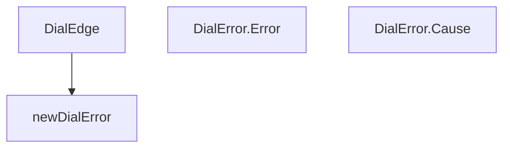

# Behavior Atom: edgediscovery/dial.go

## Source Anchor

- Go source: [cloudflare/cloudflared@2026.3.0/edgediscovery/dial.go](https://github.com/cloudflare/cloudflared/blob/2026.3.0/edgediscovery/dial.go)
- Package: edgediscovery
- Module group: edgediscovery

## Behavioral Responsibility

Core package behavior anchored to this source file.

## Entry Points

- DialEdge(ctx context.Context, timeout time.Duration, tlsConfig *tls.Config, edgeTCPAddr*net.TCPAddr, localIP net.IP) (net.Conn, error) (line 13)
- (DialError) Error() string (line 53)
- (DialError) Cause() error (line 57)

## Internal Function Surface

- newDialError(err error, message string) error (line 49)

## Input Contract

- func-param:ctx context.Context
- func-param:edgeTCPAddr *net.TCPAddr
- func-param:err error
- func-param:localIP net.IP
- func-param:message string
- func-param:timeout time.Duration
- func-param:tlsConfig *tls.Config

## Output Contract

- return:error
- return:net.Conn
- return:string

## Side Effects and State Transitions

- network I/O

## Branching and Failure Semantics

- Branch density: if=3, switch=0, select=0
- error-return paths

## Import and Dependency Surface

- context
- crypto/tls
- github.com/pkg/errors
- net
- time

## Go-Impl Flow (Intra-file)

## Rust Porting Notes

- **TLS dialer**: `crypto/tls.Dial` with context timeout → `tokio_rustls::TlsConnector::connect()` with `tokio::time::timeout()`.
- **Custom dial error**: `DialError` wrapping net errors → `#[derive(thiserror::Error)]` with `#[from]` for `std::io::Error`.
- **Quirk — 3 if-branches**: Minimal; straightforward `?` chain.

## Accuracy Notes

- Generated from Go AST parsing and source text pattern extraction.
- Source link is authoritative for disputed semantics; keep this atom synchronized with the linked file.
