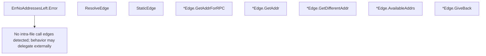

# Behavior Atom: edgediscovery/edgediscovery.go

## Source Anchor

- Go source: [cloudflare/cloudflared@2026.3.0/edgediscovery/edgediscovery.go](https://github.com/cloudflare/cloudflared/blob/2026.3.0/edgediscovery/edgediscovery.go)
- Package: edgediscovery
- Module group: edgediscovery

## Behavioral Responsibility

Core package behavior anchored to this source file.

## Entry Points

- (ErrNoAddressesLeft) Error() string (line 21)
- ResolveEdge(log *zerolog.Logger, region string, edgeIpVersion allregions.ConfigIPVersion) (*Edge, error) (line 38)
- StaticEdge(log *zerolog.Logger, hostnames []string) (*Edge, error) (line 50)
- (*Edge) GetAddrForRPC() (*allregions.EdgeAddr, error) (line 66)
- (*Edge) GetAddr(connIndex int) (*allregions.EdgeAddr, error) (line 77)
- (*Edge) GetDifferentAddr(connIndex int, hasConnectivityError bool) (*allregions.EdgeAddr, error) (line 102)
- (*Edge) AvailableAddrs() int (line 128)
- (*Edge) GiveBack(addr*allregions.EdgeAddr, hasConnectivityError bool) bool (line 136)

## Internal Function Surface

- None detected.

## Input Contract

- func-param:addr *allregions.EdgeAddr
- func-param:connIndex int
- func-param:edgeIpVersion allregions.ConfigIPVersion
- func-param:hasConnectivityError bool
- func-param:hostnames []string
- func-param:log *zerolog.Logger
- func-param:region string

## Output Contract

- return:*Edge
- return:*allregions.EdgeAddr
- return:bool
- return:error
- return:int
- return:string
- stdout/stderr or structured logs

## Side Effects and State Transitions

- concurrency primitives

## Branching and Failure Semantics

- Branch density: if=7, switch=0, select=0
- error-return paths

## Import and Dependency Surface

- github.com/cloudflare/cloudflared/edgediscovery/allregions
- github.com/cloudflare/cloudflared/management
- github.com/rs/zerolog
- sync

## Go-Impl Flow (Intra-file)

## Rust Porting Notes

- **Mutex-protected Edge**: `sync.Mutex` guarding address pool state → `Arc<Mutex<EdgeState>>` or `parking_lot::Mutex` (sync-safe, no poisoning).
- **Address pool delegation**: Delegates to `allregions` sub-package → compose `Regions` struct within `Edge`.
- **Quirk — 7 if-branches**: Pool exhaustion checks; use `Option` returns.

## Accuracy Notes

- Generated from Go AST parsing and source text pattern extraction.
- Source link is authoritative for disputed semantics; keep this atom synchronized with the linked file.
