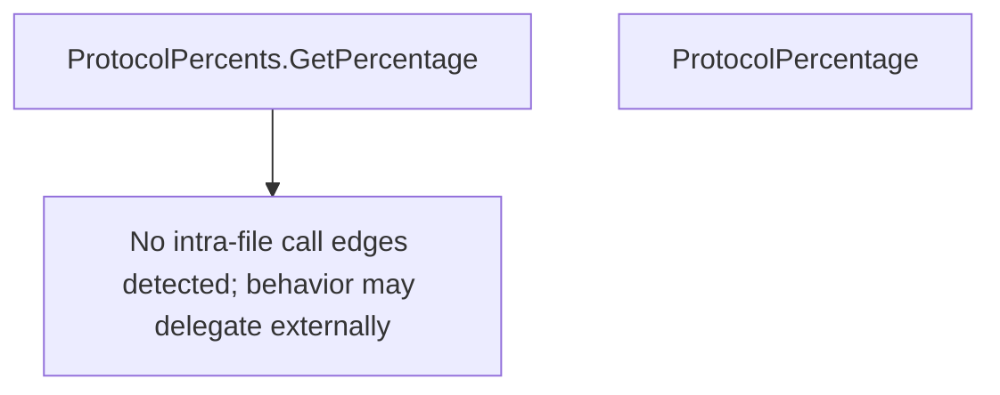

# Behavior Atom: edgediscovery/protocol.go

## Source Anchor

- Go source: [cloudflare/cloudflared@2026.3.0/edgediscovery/protocol.go](https://github.com/cloudflare/cloudflared/blob/2026.3.0/edgediscovery/protocol.go)
- Package: edgediscovery
- Module group: edgediscovery

## Behavioral Responsibility

Core package behavior anchored to this source file.

## Entry Points

- (ProtocolPercents) GetPercentage(protocol string) int32 (line 30)
- ProtocolPercentage() (ProtocolPercents, error) (line 40)

## Internal Function Surface

- None detected.

## Input Contract

- func-param:protocol string
- serialized configuration payloads

## Output Contract

- return:ProtocolPercents
- return:error
- return:int32

## Side Effects and State Transitions

- network I/O

## Branching and Failure Semantics

- Branch density: if=3, switch=0, select=0
- error-return paths

## Import and Dependency Surface

- encoding/json
- fmt
- net
- strings

## Go-Impl Flow (Intra-file)

## Rust Porting Notes

- **DNS TXT lookup**: `net.LookupTXT` for protocol percentage → `hickory_resolver::TokioAsyncResolver::txt_lookup()`.
- **JSON parsing from TXT**: Parses JSON from DNS TXT record value → `serde_json::from_str()` on resolved record.
- **Quirk — 3 if-branches**: Minimal error handling.

## Accuracy Notes

- Generated from Go AST parsing and source text pattern extraction.
- Source link is authoritative for disputed semantics; keep this atom synchronized with the linked file.
