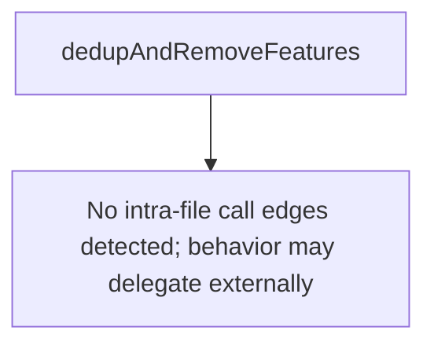

# Behavior Atom: features/features.go

## Source Anchor

- Go source: [cloudflare/cloudflared@2026.3.0/features/features.go](https://github.com/cloudflare/cloudflared/blob/2026.3.0/features/features.go)
- Package: features
- Module group: features

## Behavioral Responsibility

Core package behavior anchored to this source file.

## Entry Points

- No exported/main/init entry point detected; behavior is internal support logic.

## Internal Function Surface

- dedupAndRemoveFeatures(features []string) []string (line 67)

## Input Contract

- func-param:features []string

## Output Contract

- return:[]string

## Side Effects and State Transitions

- No high-signal side effect pattern detected in static scan.

## Branching and Failure Semantics

- Branch density: if=1, switch=0, select=0
- No explicit failure pattern markers found in static scan.

## Import and Dependency Surface

- slices

## Go-Impl Flow (Intra-file)

## Rust Porting Notes

- **Slice dedup**: `slices.Compact` for feature deduplication → `Vec::dedup()` after `sort()`.
- **Quirk — 1 if-branch**: Near-trivial; direct translation.

## Accuracy Notes

- Generated from Go AST parsing and source text pattern extraction.
- Source link is authoritative for disputed semantics; keep this atom synchronized with the linked file.
