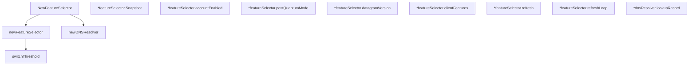

# Behavior Atom: features/selector.go

## Source Anchor

- Go source: [cloudflare/cloudflared@2026.3.0/features/selector.go](https://github.com/cloudflare/cloudflared/blob/2026.3.0/features/selector.go)
- Package: features
- Module group: features

## Behavioral Responsibility

Core package behavior anchored to this source file.

## Entry Points

- NewFeatureSelector(ctx context.Context, accountTag string, cliFeatures []string, pq bool, logger *zerolog.Logger) (FeatureSelector, error) (line 33)
- (*featureSelector) Snapshot() FeatureSnapshot (line 85)

## Internal Function Surface

- newFeatureSelector(ctx context.Context, accountTag string, logger *zerolog.Logger, resolver resolver, cliFeatures []string, pq bool, refreshFreq time.Duration) (*featureSelector, error) (line 55)
- (*featureSelector) accountEnabled(percentage uint32) bool (line 95)
- (*featureSelector) postQuantumMode() PostQuantumMode (line 99)
- (*featureSelector) datagramVersion() DatagramVersion (line 107)
- (*featureSelector) clientFeatures() []string (line 125)
- (*featureSelector) refresh(ctx context.Context) error (line 130)
- (*featureSelector) refreshLoop(ctx context.Context, refreshFreq time.Duration) (line 149)
- newDNSResolver() *dnsResolver (line 173)
- (*dnsResolver) lookupRecord(ctx context.Context) ([]byte, error) (line 179)
- switchThreshold(accountTag string) uint32 (line 195)

## Input Contract

- func-param:accountTag string
- func-param:cliFeatures []string
- func-param:ctx context.Context
- func-param:logger *zerolog.Logger
- func-param:percentage uint32
- func-param:pq bool
- func-param:refreshFreq time.Duration
- func-param:resolver resolver
- serialized configuration payloads

## Output Contract

- HTTP response writes
- return:*dnsResolver
- return:*featureSelector
- return:DatagramVersion
- return:FeatureSelector
- return:FeatureSnapshot
- return:PostQuantumMode
- return:[]byte
- return:[]string
- return:bool
- return:error
- return:uint32
- stdout/stderr or structured logs

## Side Effects and State Transitions

- network I/O
- concurrency primitives
- timers and scheduling

## Branching and Failure Semantics

- Branch density: if=11, switch=0, select=1
- error-return paths

## Import and Dependency Surface

- context
- encoding/json
- fmt
- github.com/rs/zerolog
- hash/fnv
- net
- slices
- sync
- time

## Go-Impl Flow (Intra-file)

## Rust Porting Notes

- **Goroutine refresh loop**: `refreshLoop` with `select` on context + ticker → `tokio::spawn` with `tokio::select!` on `CancellationToken` + `interval.tick()`.
- **Mutex-protected state**: `sync.Mutex` for feature set updates → `Arc<RwLock<HashSet<Feature>>>`.
- **DNS resolver**: `net.Resolver` for feature discovery via TXT records → `hickory_resolver::TokioAsyncResolver`.
- **Quirk — 11 if-branches**: Error recovery in refresh loop; log + continue pattern.

## Accuracy Notes

- Generated from Go AST parsing and source text pattern extraction.
- Source link is authoritative for disputed semantics; keep this atom synchronized with the linked file.
