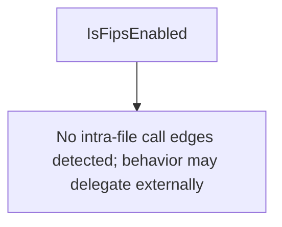

# Behavior Atom: fips/fips.go

## Source Anchor

- Go source: [cloudflare/cloudflared@2026.3.0/fips/fips.go](https://github.com/cloudflare/cloudflared/blob/2026.3.0/fips/fips.go)
- Package: fips
- Module group: fips

## Behavioral Responsibility

Core package behavior anchored to this source file.

## Entry Points

- IsFipsEnabled() bool (line 9)

## Internal Function Surface

- None detected.

## Input Contract

- Inputs are indirect through callers; no direct input pattern detected statically.

## Output Contract

- return:bool

## Side Effects and State Transitions

- No high-signal side effect pattern detected in static scan.

## Branching and Failure Semantics

- Branch density: if=0, switch=0, select=0
- No explicit failure pattern markers found in static scan.

## Import and Dependency Surface

- crypto/tls/fipsonly

## Go-Impl Flow (Intra-file)

## Rust Porting Notes

- **Build-tag FIPS**: `crypto/tls/fipsonly` import via build tag → `#[cfg(feature = "fips")]` with `rustls-fips` or `boring-rustls` crate for FIPS-compliant TLS.
- **Quirk — zero branching**: Compile-time only; Rust feature flag equivalent.

## Accuracy Notes

- Generated from Go AST parsing and source text pattern extraction.
- Source link is authoritative for disputed semantics; keep this atom synchronized with the linked file.
