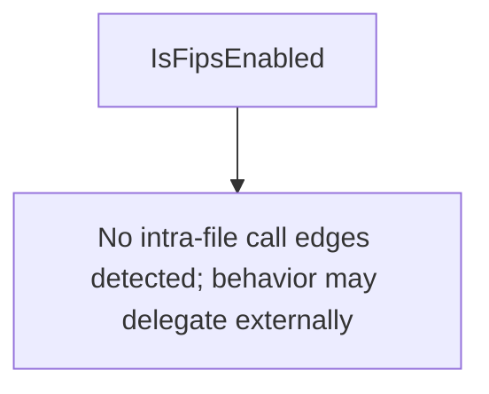

# Behavior Atom: fips/nofips.go

## Source Anchor

- Go source: [cloudflare/cloudflared@2026.3.0/fips/nofips.go](https://github.com/cloudflare/cloudflared/blob/2026.3.0/fips/nofips.go)
- Package: fips
- Module group: fips

## Behavioral Responsibility

Core package behavior anchored to this source file.

## Entry Points

- IsFipsEnabled() bool (line 5)

## Internal Function Surface

- None detected.

## Input Contract

- Inputs are indirect through callers; no direct input pattern detected statically.

## Output Contract

- return:bool

## Side Effects and State Transitions

- No high-signal side effect pattern detected in static scan.

## Branching and Failure Semantics

- Branch density: if=0, switch=0, select=0
- No explicit failure pattern markers found in static scan.

## Import and Dependency Surface

- No imports.

## Go-Impl Flow (Intra-file)

## Rust Porting Notes

- **Build-tag negation**: `//go:build !fips` stub → `#[cfg(not(feature = "fips"))]` no-op module. Trivial.

## Accuracy Notes

- Generated from Go AST parsing and source text pattern extraction.
- Source link is authoritative for disputed semantics; keep this atom synchronized with the linked file.
