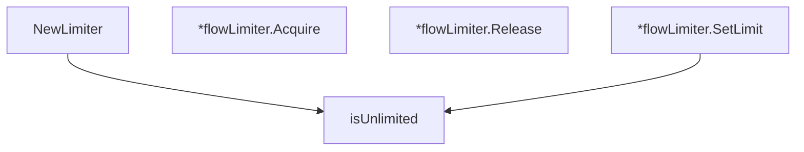

# Behavior Atom: flow/limiter.go

## Source Anchor

- Go source: [cloudflare/cloudflared@2026.3.0/flow/limiter.go](https://github.com/cloudflare/cloudflared/blob/2026.3.0/flow/limiter.go)
- Package: flow
- Module group: flow

## Behavioral Responsibility

Core package behavior anchored to this source file.

## Entry Points

- NewLimiter(maxActiveFlows uint64) Limiter (line 33)
- (*flowLimiter) Acquire(flowType string) error (line 42)
- (*flowLimiter) Release() (line 55)
- (*flowLimiter) SetLimit(newMaxActiveFlows uint64) (line 66)

## Internal Function Surface

- isUnlimited(value uint64) bool (line 75)

## Input Contract

- func-param:flowType string
- func-param:maxActiveFlows uint64
- func-param:newMaxActiveFlows uint64
- func-param:value uint64

## Output Contract

- return:Limiter
- return:bool
- return:error

## Side Effects and State Transitions

- concurrency primitives

## Branching and Failure Semantics

- Branch density: if=2, switch=0, select=0
- No explicit failure pattern markers found in static scan.

## Import and Dependency Surface

- errors
- sync

## Go-Impl Flow (Intra-file)

## Rust Porting Notes

- **Limiter interface**: `Limiter` with acquire/release → `trait Limiter: Send + Sync { fn acquire(&self) -> Result<()>; fn release(&self); }`.
- **Mutex-guarded counter**: `sync.Mutex` for concurrent flow limiting → `Arc<Mutex<usize>>` or `tokio::sync::Semaphore`.
- **Quirk — 2 if-branches**: Minimal; direct translation.

## Accuracy Notes

- Generated from Go AST parsing and source text pattern extraction.
- Source link is authoritative for disputed semantics; keep this atom synchronized with the linked file.
