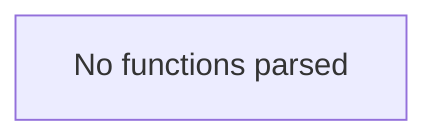

# Behavior Atom: flow/metrics.go

## Source Anchor

- Go source: [cloudflare/cloudflared@2026.3.0/flow/metrics.go](https://github.com/cloudflare/cloudflared/blob/2026.3.0/flow/metrics.go)
- Package: flow
- Module group: flow

## Behavioral Responsibility

Core package behavior anchored to this source file.

## Entry Points

- No exported/main/init entry point detected; behavior is internal support logic.

## Internal Function Surface

- None detected.

## Input Contract

- Inputs are indirect through callers; no direct input pattern detected statically.

## Output Contract

- metrics emission

## Side Effects and State Transitions

- No high-signal side effect pattern detected in static scan.

## Branching and Failure Semantics

- Branch density: if=0, switch=0, select=0
- No explicit failure pattern markers found in static scan.

## Import and Dependency Surface

- github.com/prometheus/client_golang/prometheus
- github.com/prometheus/client_golang/prometheus/promauto

## Go-Impl Flow (Intra-file)

## Rust Porting Notes

- **Prometheus declarations**: `promauto.NewGaugeVec` global registrations → `once_cell::sync::Lazy<prometheus::GaugeVec>` or `LazyLock`.
- **Quirk — zero branching**: Pure metric definitions; direct translation.

## Accuracy Notes

- Generated from Go AST parsing and source text pattern extraction.
- Source link is authoritative for disputed semantics; keep this atom synchronized with the linked file.
