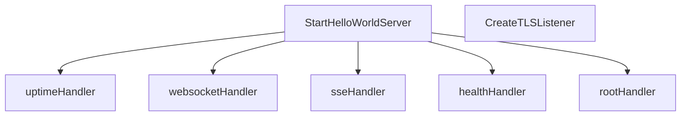

# Behavior Atom: hello/hello.go

## Source Anchor

- Go source: [cloudflare/cloudflared@2026.3.0/hello/hello.go](https://github.com/cloudflare/cloudflared/blob/2026.3.0/hello/hello.go)
- Package: hello
- Module group: hello

## Behavioral Responsibility

Core package behavior anchored to this source file.

## Entry Points

- StartHelloWorldServer(log *zerolog.Logger, listener net.Listener, shutdownC <-chan struct{}) error (line 102)
- CreateTLSListener(address string) (net.Listener, error) (line 130)

## Internal Function Surface

- uptimeHandler(startTime time.Time) http.HandlerFunc (line 145)
- websocketHandler(log *zerolog.Logger, upgrader websocket.Upgrader) http.HandlerFunc (line 161)
- sseHandler(log *zerolog.Logger) http.HandlerFunc (line 190)
- healthHandler() http.HandlerFunc (line 226)
- rootHandler(serverName string) http.HandlerFunc (line 232)

## Input Contract

- HTTP requests
- func-param:address string
- func-param:listener net.Listener
- func-param:log *zerolog.Logger
- func-param:serverName string
- func-param:shutdownC <-chan struct{}
- func-param:startTime time.Time
- func-param:upgrader websocket.Upgrader

## Output Contract

- HTTP response writes
- return:error
- return:http.HandlerFunc
- return:net.Listener
- stdout/stderr or structured logs

## Side Effects and State Transitions

- network I/O
- concurrency primitives
- timers and scheduling

## Branching and Failure Semantics

- Branch density: if=13, switch=0, select=1
- error-return paths

## Import and Dependency Surface

- bytes
- crypto/tls
- encoding/json
- fmt
- github.com/cloudflare/cloudflared/tlsconfig
- github.com/gorilla/websocket
- github.com/rs/zerolog
- html/template
- io
- net
- net/http
- os
- time

## Go-Impl Flow (Intra-file)

## Rust Porting Notes

- **HTTP server with graceful shutdown**: `http.Server` + goroutine close via `<-chan struct{}` → `axum::Server::bind().serve()` with `tokio::signal::ctrl_c()` graceful shutdown.
- **WebSocket upgrader**: `gorilla/websocket.Upgrader` → `axum::extract::ws::WebSocketUpgrade` or `tokio_tungstenite`.
- **Embedded HTML template**: `html/template` → `askama` or `include_str!()` with format replacement.
- **TLS listener**: `tls.Listen` → `tokio_rustls::TlsAcceptor` wrapping `TcpListener`.
- **Quirk — 13 if-branches**: Server setup + error paths; chain with `?`.

## Accuracy Notes

- Generated from Go AST parsing and source text pattern extraction.
- Source link is authoritative for disputed semantics; keep this atom synchronized with the linked file.
