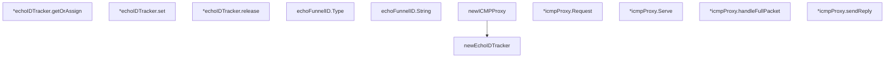

# Behavior Atom: ingress/icmp_darwin.go

## Source Anchor

- Go source: [cloudflare/cloudflared@2026.3.0/ingress/icmp_darwin.go](https://github.com/cloudflare/cloudflared/blob/2026.3.0/ingress/icmp_darwin.go)
- Package: ingress
- Module group: ingress

## Behavioral Responsibility

Ingress matching and origin dispatch behavior.

## Entry Points

- (echoFunnelID) Type() string (line 107)
- (echoFunnelID) String() string (line 111)
- (*icmpProxy) Request(ctx context.Context, pk*packet.ICMP, responder ICMPResponder) error (line 130)
- (*icmpProxy) Serve(ctx context.Context) error (line 198)

## Internal Function Surface

- newEchoIDTracker() *echoIDTracker (line 49)
- (*echoIDTracker) getOrAssign(key flow3Tuple) (id uint16, success bool) (line 56)
- (*echoIDTracker) set(key flow3Tuple, assignedEchoID uint16) (line 86)
- (*echoIDTracker) release(key flow3Tuple, assigned uint16) bool (line 92)
- newICMPProxy(listenIP netip.Addr, logger *zerolog.Logger, idleTimeout time.Duration) (*icmpProxy, error) (line 115)
- (*icmpProxy) handleFullPacket(ctx context.Context, decoder*packet.ICMPDecoder, rawPacket []byte) error (line 234)
- (*icmpProxy) sendReply(ctx context.Context, reply*echoReply) error (line 254)

## Input Contract

- func-param:assigned uint16
- func-param:assignedEchoID uint16
- func-param:ctx context.Context
- func-param:decoder *packet.ICMPDecoder
- func-param:idleTimeout time.Duration
- func-param:key flow3Tuple
- func-param:listenIP netip.Addr
- func-param:logger *zerolog.Logger
- func-param:pk *packet.ICMP
- func-param:rawPacket []byte
- func-param:reply *echoReply
- func-param:responder ICMPResponder

## Output Contract

- return:*echoIDTracker
- return:*icmpProxy
- return:bool
- return:error
- return:id uint16
- return:string
- return:success bool
- stdout/stderr or structured logs

## Side Effects and State Transitions

- network I/O
- concurrency primitives

## Branching and Failure Semantics

- Branch density: if=24, switch=0, select=0
- error-return paths

## Import and Dependency Surface

- context
- fmt
- github.com/cloudflare/cloudflared/packet
- github.com/cloudflare/cloudflared/tracing
- github.com/rs/zerolog
- go.opentelemetry.io/otel/attribute
- golang.org/x/net/icmp
- math
- net/netip
- strconv
- sync
- time

## Go-Impl Flow (Intra-file)

## Rust Porting Notes

- **Darwin raw sockets**: ICMP echo via raw socket with echo ID tracking → `socket2::Socket` with `Type::RAW` and `Protocol::ICMPV4`, or `pnet` crate.
- **Build tag**: `//go:build darwin` → `#[cfg(target_os = "macos")]`.
- **Echo ID tracking**: `sync.Map` for active echo IDs → `DashMap<u16, oneshot::Sender<IcmpReply>>`.
- **Quirk — 24 if-branches**: Socket setup/error handling; chain with `?`.

## Accuracy Notes

- Generated from Go AST parsing and source text pattern extraction.
- Source link is authoritative for disputed semantics; keep this atom synchronized with the linked file.
