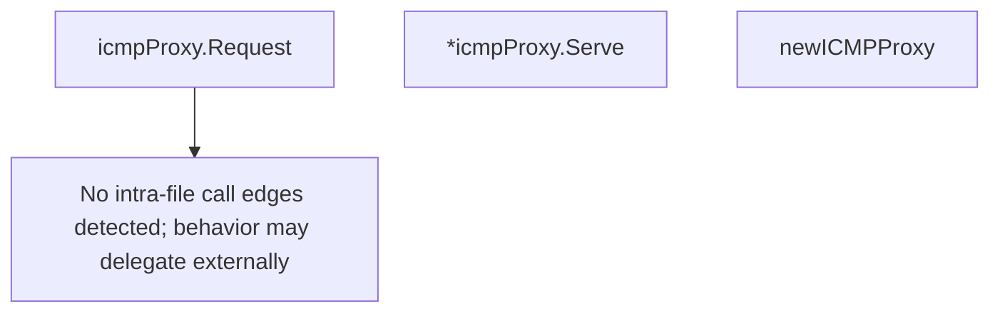

# Behavior Atom: ingress/icmp_generic.go

## Source Anchor

- Go source: [cloudflare/cloudflared@2026.3.0/ingress/icmp_generic.go](https://github.com/cloudflare/cloudflared/blob/2026.3.0/ingress/icmp_generic.go)
- Package: ingress
- Module group: ingress

## Behavioral Responsibility

Ingress matching and origin dispatch behavior.

## Entry Points

- (icmpProxy) Request(ctx context.Context, pk *packet.ICMP, responder ICMPResponder) error (line 21)
- (*icmpProxy) Serve(ctx context.Context) error (line 25)

## Internal Function Surface

- newICMPProxy(listenIP netip.Addr, logger *zerolog.Logger, idleTimeout time.Duration) (*icmpProxy, error) (line 29)

## Input Contract

- func-param:ctx context.Context
- func-param:idleTimeout time.Duration
- func-param:listenIP netip.Addr
- func-param:logger *zerolog.Logger
- func-param:pk *packet.ICMP
- func-param:responder ICMPResponder

## Output Contract

- return:*icmpProxy
- return:error
- stdout/stderr or structured logs

## Side Effects and State Transitions

- network I/O

## Branching and Failure Semantics

- Branch density: if=0, switch=0, select=0
- No explicit failure pattern markers found in static scan.

## Import and Dependency Surface

- context
- fmt
- github.com/cloudflare/cloudflared/packet
- github.com/rs/zerolog
- net/netip
- runtime
- time

## Go-Impl Flow (Intra-file)

## Rust Porting Notes

- **Platform stub**: Generic no-op ICMP implementation for unsupported platforms → `#[cfg(not(any(target_os = "linux", target_os = "macos", target_os = "windows")))]` with stub returning `Err(Unsupported)`.
- **Quirk — zero branching**: Pure type stubs; direct translation.

## Accuracy Notes

- Generated from Go AST parsing and source text pattern extraction.
- Source link is authoritative for disputed semantics; keep this atom synchronized with the linked file.
