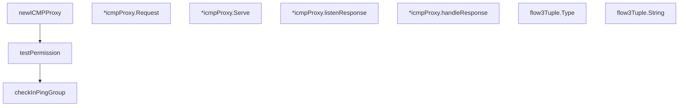

# Behavior Atom: ingress/icmp_linux.go

## Source Anchor

- Go source: [cloudflare/cloudflared@2026.3.0/ingress/icmp_linux.go](https://github.com/cloudflare/cloudflared/blob/2026.3.0/ingress/icmp_linux.go)
- Package: ingress
- Module group: ingress

## Behavioral Responsibility

Ingress matching and origin dispatch behavior.

## Entry Points

- (*icmpProxy) Request(ctx context.Context, pk*packet.ICMP, responder ICMPResponder) error (line 99)
- (*icmpProxy) Serve(ctx context.Context) error (line 166)
- (flow3Tuple) Type() string (line 224)
- (flow3Tuple) String() string (line 228)

## Internal Function Surface

- newICMPProxy(listenIP netip.Addr, logger *zerolog.Logger, idleTimeout time.Duration) (*icmpProxy, error) (line 44)
- testPermission(listenIP netip.Addr, logger *zerolog.Logger) error (line 56)
- checkInPingGroup() error (line 74)
- (*icmpProxy) listenResponse(ctx context.Context, flow*icmpEchoFlow) (line 171)
- (*icmpProxy) handleResponse(ctx context.Context, flow*icmpEchoFlow, buf []byte) done bool (line 181)

## Input Contract

- func-param:buf []byte
- func-param:ctx context.Context
- func-param:flow *icmpEchoFlow
- func-param:idleTimeout time.Duration
- func-param:listenIP netip.Addr
- func-param:logger *zerolog.Logger
- func-param:pk *packet.ICMP
- func-param:responder ICMPResponder

## Output Contract

- return:*icmpProxy
- return:done bool
- return:error
- return:string
- stdout/stderr or structured logs

## Side Effects and State Transitions

- network I/O
- filesystem I/O
- concurrency primitives

## Branching and Failure Semantics

- Branch density: if=22, switch=0, select=0
- error-return paths

## Import and Dependency Surface

- context
- fmt
- github.com/cloudflare/cloudflared/packet
- github.com/cloudflare/cloudflared/tracing
- github.com/pkg/errors
- github.com/rs/zerolog
- go.opentelemetry.io/otel/attribute
- net
- net/netip
- os
- regexp
- strconv
- time

## Go-Impl Flow (Intra-file)

## Rust Porting Notes

- **Linux ICMP capabilities**: Uses `IPPROTO_ICMP` with `SOCK_DGRAM` for unprivileged ICMP → `socket2::Socket::new(Domain::IPV4, Type::DGRAM, Some(Protocol::ICMPV4))` if kernel supports.
- **procfs route parsing**: Reads `/proc/net/route` for default gateway detection → `tokio::fs::read_to_string("/proc/net/route")` + line parsing.
- **Build tag**: `//go:build linux` → `#[cfg(target_os = "linux")]`.
- **Quirk — 22 if-branches**: Capability detection + route parsing; many error paths suited for `?`.

## Accuracy Notes

- Generated from Go AST parsing and source text pattern extraction.
- Source link is authoritative for disputed semantics; keep this atom synchronized with the linked file.
