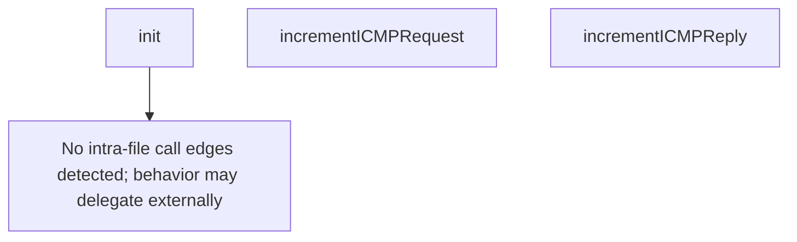

# Behavior Atom: ingress/icmp_metrics.go

## Source Anchor

- Go source: [cloudflare/cloudflared@2026.3.0/ingress/icmp_metrics.go](https://github.com/cloudflare/cloudflared/blob/2026.3.0/ingress/icmp_metrics.go)
- Package: ingress
- Module group: ingress

## Behavioral Responsibility

Ingress matching and origin dispatch behavior.

## Entry Points

- init() (line 26)

## Internal Function Surface

- incrementICMPRequest() (line 33)
- incrementICMPReply() (line 37)

## Input Contract

- Inputs are indirect through callers; no direct input pattern detected statically.

## Output Contract

- metrics emission

## Side Effects and State Transitions

- No high-signal side effect pattern detected in static scan.

## Branching and Failure Semantics

- Branch density: if=0, switch=0, select=0
- No explicit failure pattern markers found in static scan.

## Import and Dependency Surface

- github.com/prometheus/client_golang/prometheus

## Go-Impl Flow (Intra-file)

## Rust Porting Notes

- **init() Prometheus registration**: Go `init()` auto-registering metrics → `once_cell::sync::Lazy<prometheus::IntCounterVec>` or `LazyLock`.
- **Quirk — zero branching**: Pure metric definitions; direct translation.

## Accuracy Notes

- Generated from Go AST parsing and source text pattern extraction.
- Source link is authoritative for disputed semantics; keep this atom synchronized with the linked file.
