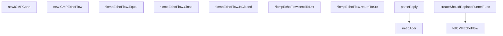

# Behavior Atom: ingress/icmp_posix.go

## Source Anchor

- Go source: [cloudflare/cloudflared@2026.3.0/ingress/icmp_posix.go](https://github.com/cloudflare/cloudflared/blob/2026.3.0/ingress/icmp_posix.go)
- Package: ingress
- Module group: ingress

## Behavioral Responsibility

Ingress matching and origin dispatch behavior.

## Entry Points

- (*icmpEchoFlow) Equal(other packet.Funnel) bool (line 68)
- (*icmpEchoFlow) Close() error (line 85)
- (*icmpEchoFlow) IsClosed() bool (line 90)

## Internal Function Surface

- newICMPConn(listenIP netip.Addr) (*icmp.PacketConn, error) (line 21)
- netipAddr(addr net.Addr) (netip.Addr, bool) (line 28)
- newICMPEchoFlow(src netip.Addr, closeCallback func() error, originConn *icmp.PacketConn, responder ICMPResponder, assignedEchoID int, originalEchoID int)*icmpEchoFlow (line 55)
- (*icmpEchoFlow) sendToDst(dst netip.Addr, msg*icmp.Message) error (line 95)
- (*icmpEchoFlow) returnToSrc(reply*echoReply) error (line 123)
- parseReply(from net.Addr, rawMsg []byte) (*echoReply, error) (line 145)
- toICMPEchoFlow(funnel packet.Funnel) (*icmpEchoFlow, error) (line 169)
- createShouldReplaceFunnelFunc(logger *zerolog.Logger, responder ICMPResponder, pk*packet.ICMP, originalEchoID int) func(packet.Funnel) bool (line 177)

## Input Contract

- func-param:addr net.Addr
- func-param:assignedEchoID int
- func-param:closeCallback func() error
- func-param:dst netip.Addr
- func-param:from net.Addr
- func-param:funnel packet.Funnel
- func-param:listenIP netip.Addr
- func-param:logger *zerolog.Logger
- func-param:msg *icmp.Message
- func-param:originConn *icmp.PacketConn
- func-param:originalEchoID int
- func-param:other packet.Funnel
- func-param:pk *packet.ICMP
- func-param:rawMsg []byte
- func-param:reply *echoReply
- func-param:responder ICMPResponder
- func-param:src netip.Addr

## Output Contract

- return:*echoReply
- return:*icmp.PacketConn
- return:*icmpEchoFlow
- return:bool
- return:error
- return:func(packet.Funnel) bool
- return:netip.Addr
- stdout/stderr or structured logs

## Side Effects and State Transitions

- network I/O
- concurrency primitives

## Branching and Failure Semantics

- Branch density: if=15, switch=0, select=0
- error-return paths

## Import and Dependency Surface

- fmt
- github.com/cloudflare/cloudflared/packet
- github.com/google/gopacket/layers
- github.com/rs/zerolog
- golang.org/x/net/icmp
- net
- net/netip
- sync/atomic

## Go-Impl Flow (Intra-file)

## Rust Porting Notes

- **Close callback + sync/atomic**: `sync.Once` for one-shot close + atomic booleans → `tokio::sync::Notify` for one-shot close, `AtomicBool` for state flags.
- **Socket read loop**: Blocking `conn.ReadFrom()` in goroutine → `tokio::net::UdpSocket::recv_from()` in async loop.
- **Build tag**: `//go:build !windows` → `#[cfg(unix)]`.
- **Quirk — 15 if-branches**: Close-state checks; use `select!` with cancellation token.

## Accuracy Notes

- Generated from Go AST parsing and source text pattern extraction.
- Source link is authoritative for disputed semantics; keep this atom synchronized with the linked file.
