# Behavior Atom: ingress/icmp_windows.go

## Source Anchor

- Go source: [cloudflare/cloudflared@2026.3.0/ingress/icmp_windows.go](https://github.com/cloudflare/cloudflared/blob/2026.3.0/ingress/icmp_windows.go)
- Package: ingress
- Module group: ingress

## Behavioral Responsibility

Ingress matching and origin dispatch behavior.

## Entry Points

- (ipStatus) String() string (line 90)
- (*icmpProxy) Serve(ctx context.Context) error (line 253)
- (*icmpProxy) Request(ctx context.Context, pk*packet.ICMP, responder ICMPResponder) error (line 262)

## Internal Function Surface

- newSockAddrIn6(addr netip.Addr) (*sockAddrIn6, error) (line 198)
- newICMPProxy(listenIP netip.Addr, logger *zerolog.Logger, idleTimeout time.Duration) (*icmpProxy, error) (line 226)
- (*icmpProxy) handleEchoReply(request*packet.ICMP, echoReq *icmp.Echo, resp echoResp, responder ICMPResponder) error (line 303)
- (*icmpProxy) icmpEchoRoundtrip(dst netip.Addr, echo*icmp.Echo) (echoResp, error) (line 331)
- (*icmpProxy) icmpSendEcho(dst netip.Addr, echo*icmp.Echo) (*echoV4Resp, error) (line 369)
- inAddrV4(ip netip.Addr) (uint32, error) (line 401)
- (*echoV4Resp) status() ipStatus (line 420)
- (*echoV4Resp) rtt() uint32 (line 424)
- (*echoV4Resp) payload() []byte (line 428)
- newEchoV4Resp(replyBuf []byte) (*echoV4Resp, error) (line 432)
- (*icmpProxy) icmp6SendEcho(dst netip.Addr, echo*icmp.Echo) (*echoV6Resp, error) (line 473)
- (*echoV6Resp) status() ipStatus (line 518)
- (*echoV6Resp) rtt() uint32 (line 522)
- (*echoV6Resp) payload() []byte (line 526)
- newEchoV6Resp(replyBuf []byte, dataSize int) (*echoV6Resp, error) (line 530)
- unmarshalIPStatus(replyBuf []byte) (ipStatus, error) (line 547)

## Input Contract

- func-param:addr netip.Addr
- func-param:ctx context.Context
- func-param:dataSize int
- func-param:dst netip.Addr
- func-param:echo *icmp.Echo
- func-param:echoReq *icmp.Echo
- func-param:idleTimeout time.Duration
- func-param:ip netip.Addr
- func-param:listenIP netip.Addr
- func-param:logger *zerolog.Logger
- func-param:pk *packet.ICMP
- func-param:replyBuf []byte
- func-param:request *packet.ICMP
- func-param:resp echoResp
- func-param:responder ICMPResponder

## Output Contract

- return:*echoV4Resp
- return:*echoV6Resp
- return:*icmpProxy
- return:*sockAddrIn6
- return:[]byte
- return:echoResp
- return:error
- return:ipStatus
- return:string
- return:uint32
- stdout/stderr or structured logs

## Side Effects and State Transitions

- network I/O

## Branching and Failure Semantics

- Branch density: if=30, switch=1, select=0
- error-return paths
- fallback/default branches

## Import and Dependency Surface

- C
- context
- encoding/binary
- fmt
- github.com/cloudflare/cloudflared/packet
- github.com/cloudflare/cloudflared/tracing
- github.com/google/gopacket/layers
- github.com/pkg/errors
- github.com/rs/zerolog
- go.opentelemetry.io/otel/attribute
- golang.org/x/net/icmp
- golang.org/x/net/ipv4
- golang.org/x/net/ipv6
- net/netip
- runtime/debug
- syscall
- time
- unsafe

## Go-Impl Flow (Intra-file)

```mermaid
flowchart TD
    F1["ipStatus.String"]
    F2["newSockAddrIn6"]
    F3["newICMPProxy"]
    F4["*icmpProxy.Serve"]
    F5["*icmpProxy.Request"]
    F6["*icmpProxy.handleEchoReply"]
    F7["*icmpProxy.icmpEchoRoundtrip"]
    F8["*icmpProxy.icmpSendEcho"]
    F9["inAddrV4"]
    F10["*echoV4Resp.status"]
    F11["*echoV4Resp.rtt"]
    F12["*echoV4Resp.payload"]
    F13["newEchoV4Resp"]
    F14["*icmpProxy.icmp6SendEcho"]
    F15["*echoV6Resp.status"]
    F16["*echoV6Resp.rtt"]
    F17["*echoV6Resp.payload"]
    F18["newEchoV6Resp"]
    F19["unmarshalIPStatus"]
    F3 --> F2
    F8 --> F9
    F8 --> F19
    F8 --> F13
    F14 --> F2
    F14 --> F19
    F14 --> F18
```

## Rust Porting Notes

- **Windows ICMP FFI**: `IcmpSendEcho` via `syscall.NewLazyDLL("iphlpapi.dll")` → `windows-sys` crate FFI bindings or `winapi::um::icmpapi::IcmpSendEcho()`.
- **Unsafe pointer arithmetic**: Request/reply buffer construction with unsafe pointer offsets → `unsafe { std::slice::from_raw_parts() }` with careful bounds checking.
- **Build tag**: `//go:build windows` → `#[cfg(target_os = "windows")]`.
- **Quirk — 30 if-branches**: Heavy error validation for FFI calls; wrap in safe Rust API layer.

## Accuracy Notes

- Generated from Go AST parsing and source text pattern extraction.
- Source link is authoritative for disputed semantics; keep this atom synchronized with the linked file.
