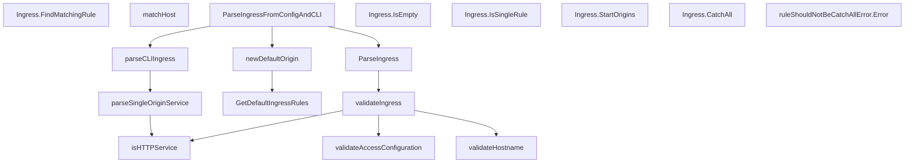

# Behavior Atom: ingress/ingress.go

## Source Anchor

- Go source: [cloudflare/cloudflared@2026.3.0/ingress/ingress.go](https://github.com/cloudflare/cloudflared/blob/2026.3.0/ingress/ingress.go)
- Package: ingress
- Module group: ingress

## Behavioral Responsibility

Ingress matching and origin dispatch behavior.

## Entry Points

- (Ingress) FindMatchingRule(hostname string, path string) (*Rule, int) (line 41)
- ParseIngress(conf *config.Configuration) (Ingress, error) (line 87)
- ParseIngressFromConfigAndCLI(conf *config.Configuration, c*cli.Context, log *zerolog.Logger) (Ingress, error) (line 98)
- (Ingress) IsEmpty() bool (line 193)
- (Ingress) IsSingleRule() bool (line 198)
- (Ingress) StartOrigins(log *zerolog.Logger, shutdownC <-chan struct{}) error (line 203)
- (Ingress) CatchAll() *Rule (line 216)
- GetDefaultIngressRules(log *zerolog.Logger) []Rule (line 222)
- (ruleShouldNotBeCatchAllError) Error() string (line 391)

## Internal Function Surface

- matchHost(ruleHost string, reqHost string) bool (line 64)
- parseCLIIngress(c *cli.Context, allowURLFromArgs bool) (Ingress, error) (line 130)
- newDefaultOrigin(c *cli.Context, log*zerolog.Logger) Ingress (line 152)
- parseSingleOriginService(c *cli.Context, allowURLFromArgs bool) (OriginService, error) (line 163)
- validateAccessConfiguration(cfg *config.AccessConfig) error (line 231)
- validateIngress(ingress []config.UnvalidatedIngressRule, defaults OriginRequestConfig) (Ingress, error) (line 245)
- validateHostname(r config.UnvalidatedIngressRule, ruleIndex int, totalRules int) error (line 361)
- isHTTPService(url *url.URL) bool (line 397)

## Input Contract

- CLI flags and command arguments
- func-param:allowURLFromArgs bool
- func-param:c *cli.Context
- func-param:cfg *config.AccessConfig
- func-param:conf *config.Configuration
- func-param:defaults OriginRequestConfig
- func-param:hostname string
- func-param:ingress []config.UnvalidatedIngressRule
- func-param:log *zerolog.Logger
- func-param:path string
- func-param:r config.UnvalidatedIngressRule
- func-param:reqHost string
- func-param:ruleHost string
- func-param:ruleIndex int
- func-param:shutdownC <-chan struct{}
- func-param:totalRules int
- func-param:url *url.URL

## Output Contract

- return:*Rule
- return:Ingress
- return:OriginService
- return:[]Rule
- return:bool
- return:error
- return:int
- return:string
- stdout/stderr or structured logs

## Side Effects and State Transitions

- network I/O

## Branching and Failure Semantics

- Branch density: if=48, switch=0, select=0
- error-return paths

## Import and Dependency Surface

- fmt
- github.com/cloudflare/cloudflared/config
- github.com/cloudflare/cloudflared/ingress/middleware
- github.com/cloudflare/cloudflared/ipaccess
- github.com/pkg/errors
- github.com/rs/zerolog
- github.com/urfave/cli/v2
- golang.org/x/net/idna
- net
- net/url
- regexp
- strconv
- strings

## Go-Impl Flow (Intra-file)

## Rust Porting Notes

- **Rule matching**: Regex-based hostname matching with rule ordering → `regex::Regex` compiled once + stored in `Vec<IngressRule>`, matched top-to-bottom.
- **IDNA canonicalization**: `golang.org/x/net/idna` for punycode → `idna` crate (`idna::domain_to_ascii()`).
- **Validation**: `Validate()` checks all rules at startup → `TryFrom<Config>` or builder with validation in `build()` method.
- **Quirk — 48 if-branches**: Complex rule validation; break into smaller validator functions.

## Accuracy Notes

- Generated from Go AST parsing and source text pattern extraction.
- Source link is authoritative for disputed semantics; keep this atom synchronized with the linked file.
