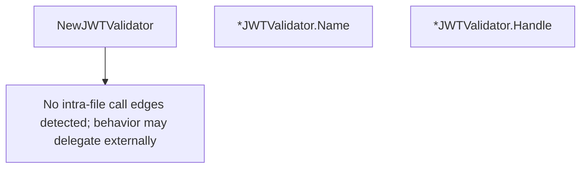

# Behavior Atom: ingress/middleware/jwtvalidator.go

## Source Anchor

- Go source: [cloudflare/cloudflared@2026.3.0/ingress/middleware/jwtvalidator.go](https://github.com/cloudflare/cloudflared/blob/2026.3.0/ingress/middleware/jwtvalidator.go)
- Package: middleware
- Module group: ingress

## Behavioral Responsibility

Ingress matching and origin dispatch behavior.

## Entry Points

- NewJWTValidator(teamName string, environment string, audTags []string) *JWTValidator (line 28)
- (*JWTValidator) Name() string (line 51)
- (*JWTValidator) Handle(ctx context.Context, r*http.Request) (*HandleResult, error) (line 55)

## Internal Function Surface

- None detected.

## Input Contract

- HTTP requests
- func-param:audTags []string
- func-param:ctx context.Context
- func-param:environment string
- func-param:r *http.Request
- func-param:teamName string

## Output Contract

- return:*HandleResult
- return:*JWTValidator
- return:error
- return:string

## Side Effects and State Transitions

- network I/O

## Branching and Failure Semantics

- Branch density: if=4, switch=0, select=0
- error-return paths

## Import and Dependency Surface

- context
- fmt
- github.com/cloudflare/cloudflared/credentials
- github.com/coreos/go-oidc/v3/oidc
- net/http

## Go-Impl Flow (Intra-file)

## Rust Porting Notes

- **OIDC integration**: `go-oidc` library for JWT validation → `openidconnect` crate with `CoreClient::discover_async()`.
- **Token verification**: `verifier.Verify(ctx, token)` → `CoreIdTokenVerifier::verify()` or `jsonwebtoken::decode()` with JWK set.
- **Quirk — 4 if-branches**: Token presence/validity checks; straightforward `Option`/`Result` handling.

## Accuracy Notes

- Generated from Go AST parsing and source text pattern extraction.
- Source link is authoritative for disputed semantics; keep this atom synchronized with the linked file.
