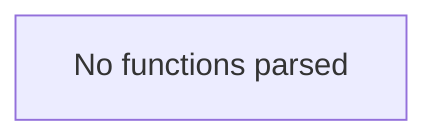

# Behavior Atom: ingress/middleware/middleware.go

## Source Anchor

- Go source: [cloudflare/cloudflared@2026.3.0/ingress/middleware/middleware.go](https://github.com/cloudflare/cloudflared/blob/2026.3.0/ingress/middleware/middleware.go)
- Package: middleware
- Module group: ingress

## Behavioral Responsibility

Ingress matching and origin dispatch behavior.

## Entry Points

- No exported/main/init entry point detected; behavior is internal support logic.

## Internal Function Surface

- None detected.

## Input Contract

- HTTP requests

## Output Contract

- Output is primarily side-effect based; no explicit return/output pattern detected statically.

## Side Effects and State Transitions

- network I/O

## Branching and Failure Semantics

- Branch density: if=0, switch=0, select=0
- error-return paths

## Import and Dependency Surface

- context
- net/http

## Go-Impl Flow (Intra-file)

## Rust Porting Notes

- **Handler interface**: `Middleware` interface wrapping `http.Handler` → `tower::Layer` + `tower::Service` middleware pattern.
- **Quirk — zero branching**: Pure trait definitions; direct translation.

## Accuracy Notes

- Generated from Go AST parsing and source text pattern extraction.
- Source link is authoritative for disputed semantics; keep this atom synchronized with the linked file.
