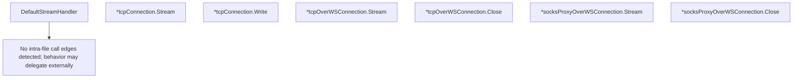

# Behavior Atom: ingress/origin_connection.go

## Source Anchor

- Go source: [cloudflare/cloudflared@2026.3.0/ingress/origin_connection.go](https://github.com/cloudflare/cloudflared/blob/2026.3.0/ingress/origin_connection.go)
- Package: ingress
- Module group: ingress

## Behavioral Responsibility

Ingress matching and origin dispatch behavior.

## Entry Points

- DefaultStreamHandler(originConn io.ReadWriter, remoteConn net.Conn, log *zerolog.Logger) (line 29)
- (*tcpConnection) Stream(_context.Context, tunnelConn io.ReadWriter,_*zerolog.Logger) (line 40)
- (*tcpConnection) Write(b []byte) (int, error) (line 44)
- (*tcpOverWSConnection) Stream(ctx context.Context, tunnelConn io.ReadWriter, log*zerolog.Logger) (line 60)
- (*tcpOverWSConnection) Close() error (line 69)
- (*socksProxyOverWSConnection) Stream(ctx context.Context, tunnelConn io.ReadWriter, log*zerolog.Logger) (line 80)
- (*socksProxyOverWSConnection) Close() error (line 89)

## Internal Function Surface

- None detected.

## Input Contract

- func-param:_ *zerolog.Logger
- func-param:_ context.Context
- func-param:b []byte
- func-param:ctx context.Context
- func-param:log *zerolog.Logger
- func-param:originConn io.ReadWriter
- func-param:remoteConn net.Conn
- func-param:tunnelConn io.ReadWriter

## Output Contract

- HTTP response writes
- return:error
- return:int
- stdout/stderr or structured logs

## Side Effects and State Transitions

- network I/O

## Branching and Failure Semantics

- Branch density: if=2, switch=0, select=0
- error-return paths

## Import and Dependency Surface

- context
- github.com/cloudflare/cloudflared/ipaccess
- github.com/cloudflare/cloudflared/socks
- github.com/cloudflare/cloudflared/stream
- github.com/cloudflare/cloudflared/websocket
- github.com/rs/zerolog
- io
- net
- time

## Go-Impl Flow (Intra-file)

## Rust Porting Notes

- **Connection adapters**: TCP, WebSocket, SOCKS5 origin connection types → `enum OriginConnection { Tcp(TcpStream), WebSocket(WebSocketStream), Socks(SocksStream) }` with shared `AsyncRead + AsyncWrite` trait.
- **Quirk — 2 if-branches**: Minimal branching; direct enum dispatch.

## Accuracy Notes

- Generated from Go AST parsing and source text pattern extraction.
- Source link is authoritative for disputed semantics; keep this atom synchronized with the linked file.
