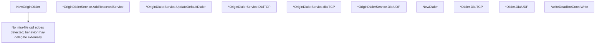

# Behavior Atom: ingress/origin_dialer.go

## Source Anchor

- Go source: [cloudflare/cloudflared@2026.3.0/ingress/origin_dialer.go](https://github.com/cloudflare/cloudflared/blob/2026.3.0/ingress/origin_dialer.go)
- Package: ingress
- Module group: ingress

## Behavioral Responsibility

Ingress matching and origin dispatch behavior.

## Entry Points

- NewOriginDialer(config OriginConfig, logger *zerolog.Logger)*OriginDialerService (line 56)
- (*OriginDialerService) AddReservedService(service OriginDialer, addrs []netip.AddrPort) (line 68)
- (*OriginDialerService) UpdateDefaultDialer(dialer*Dialer) (line 76)
- (*OriginDialerService) DialTCP(ctx context.Context, addr netip.AddrPort) (net.Conn, error) (line 83)
- (*OriginDialerService) DialUDP(addr netip.AddrPort) (net.Conn, error) (line 108)
- NewDialer(config WarpRoutingConfig) *Dialer (line 123)
- (*Dialer) DialTCP(ctx context.Context, dest netip.AddrPort) (net.Conn, error) (line 132)
- (*Dialer) DialUDP(dest netip.AddrPort) (net.Conn, error) (line 141)
- (*writeDeadlineConn) Write(b []byte) (int, error) (line 158)

## Internal Function Surface

- (*OriginDialerService) dialTCP(ctx context.Context, addr netip.AddrPort) (net.Conn, error) (line 96)

## Input Contract

- func-param:addr netip.AddrPort
- func-param:addrs []netip.AddrPort
- func-param:b []byte
- func-param:config OriginConfig
- func-param:config WarpRoutingConfig
- func-param:ctx context.Context
- func-param:dest netip.AddrPort
- func-param:dialer *Dialer
- func-param:logger *zerolog.Logger
- func-param:service OriginDialer

## Output Contract

- HTTP response writes
- return:*Dialer
- return:*OriginDialerService
- return:error
- return:int
- return:net.Conn
- stdout/stderr or structured logs

## Side Effects and State Transitions

- network I/O
- concurrency primitives

## Branching and Failure Semantics

- Branch density: if=6, switch=0, select=0
- error-return paths

## Import and Dependency Surface

- context
- fmt
- github.com/rs/zerolog
- net
- net/netip
- sync
- time

## Go-Impl Flow (Intra-file)

## Rust Porting Notes

- **Concurrent map access**: `sync.Map` for connection tracking → `DashMap` or `Arc<RwLock<HashMap>>` for concurrent origin dials.
- **TCP/UDP routing**: Dials origin based on protocol → `match protocol { Tcp => TcpStream::connect(), Udp => UdpSocket::bind() }`.
- **Quirk — 6 if-branches**: Protocol/address validation; use `match` on parsed `SocketAddr`.

## Accuracy Notes

- Generated from Go AST parsing and source text pattern extraction.
- Source link is authoritative for disputed semantics; keep this atom synchronized with the linked file.
