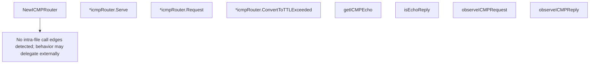

# Behavior Atom: ingress/origin_icmp_proxy.go

## Source Anchor

- Go source: [cloudflare/cloudflared@2026.3.0/ingress/origin_icmp_proxy.go](https://github.com/cloudflare/cloudflared/blob/2026.3.0/ingress/origin_icmp_proxy.go)
- Package: ingress
- Module group: ingress

## Behavioral Responsibility

Ingress matching and origin dispatch behavior.

## Entry Points

- NewICMPRouter(ipv4Addr netip.Addr, ipv6Addr netip.Addr, logger *zerolog.Logger, funnelIdleTimeout time.Duration) (ICMPRouterServer, error) (line 67)
- (*icmpRouter) Serve(ctx context.Context) error (line 91)
- (*icmpRouter) Request(ctx context.Context, pk*packet.ICMP, responder ICMPResponder) error (line 111)
- (*icmpRouter) ConvertToTTLExceeded(pk*packet.ICMP, rawPacket packet.RawPacket) *packet.ICMP (line 127)

## Internal Function Surface

- getICMPEcho(msg *icmp.Message) (*icmp.Echo, error) (line 137)
- isEchoReply(msg *icmp.Message) bool (line 145)
- observeICMPRequest(logger *zerolog.Logger, span trace.Span, src string, dst string, echoID int, seq int) (line 149)
- observeICMPReply(logger *zerolog.Logger, span trace.Span, dst string, echoID int, seq int) (line 163)

## Input Contract

- func-param:ctx context.Context
- func-param:dst string
- func-param:echoID int
- func-param:funnelIdleTimeout time.Duration
- func-param:ipv4Addr netip.Addr
- func-param:ipv6Addr netip.Addr
- func-param:logger *zerolog.Logger
- func-param:msg *icmp.Message
- func-param:pk *packet.ICMP
- func-param:rawPacket packet.RawPacket
- func-param:responder ICMPResponder
- func-param:seq int
- func-param:span trace.Span
- func-param:src string

## Output Contract

- return:*icmp.Echo
- return:*packet.ICMP
- return:ICMPRouterServer
- return:bool
- return:error
- stdout/stderr or structured logs

## Side Effects and State Transitions

- network I/O
- concurrency primitives

## Branching and Failure Semantics

- Branch density: if=12, switch=0, select=0
- error-return paths

## Import and Dependency Surface

- context
- fmt
- github.com/cloudflare/cloudflared/packet
- github.com/cloudflare/cloudflared/tracing
- github.com/rs/zerolog
- go.opentelemetry.io/otel/attribute
- go.opentelemetry.io/otel/trace
- golang.org/x/net/icmp
- golang.org/x/net/ipv4
- golang.org/x/net/ipv6
- net/netip
- time

## Go-Impl Flow (Intra-file)

## Rust Porting Notes

- **OpenTelemetry tracing**: `otel` span creation around ICMP proxy calls → `tracing::instrument` attribute macro with `opentelemetry` integration.
- **ICMP encoding**: Encodes/decodes ICMP echo request/reply packets → `pnet_packet::icmp` or manual `[u8]` serialization with checksum.
- **Quirk — 12 if-branches**: Error handling for encode/decode + proxy routing; chain with `?`.

## Accuracy Notes

- Generated from Go AST parsing and source text pattern extraction.
- Source link is authoritative for disputed semantics; keep this atom synchronized with the linked file.
