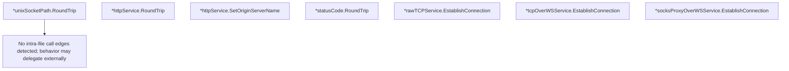

# Behavior Atom: ingress/origin_proxy.go

## Source Anchor

- Go source: [cloudflare/cloudflared@2026.3.0/ingress/origin_proxy.go](https://github.com/cloudflare/cloudflared/blob/2026.3.0/ingress/origin_proxy.go)
- Package: ingress
- Module group: ingress

## Behavioral Responsibility

Ingress matching and origin dispatch behavior.

## Entry Points

- (*unixSocketPath) RoundTrip(req*http.Request) (*http.Response, error) (line 30)
- (*httpService) RoundTrip(req*http.Request) (*http.Response, error) (line 35)
- (*httpService) SetOriginServerName(req*http.Request) (line 61)
- (*statusCode) RoundTrip(_*http.Request) (*http.Response, error) (line 75)
- (*rawTCPService) EstablishConnection(ctx context.Context, dest string, logger*zerolog.Logger) (OriginConnection, error) (line 88)
- (*tcpOverWSService) EstablishConnection(ctx context.Context, dest string, _*zerolog.Logger) (OriginConnection, error) (line 102)
- (*socksProxyOverWSService) EstablishConnection(_context.Context,_ string, _*zerolog.Logger) (OriginConnection, error) (line 119)

## Internal Function Surface

- None detected.

## Input Contract

- HTTP requests
- func-param:_ *http.Request
- func-param:_ *zerolog.Logger
- func-param:_ context.Context
- func-param:_ string
- func-param:ctx context.Context
- func-param:dest string
- func-param:logger *zerolog.Logger
- func-param:req *http.Request

## Output Contract

- return:*http.Response
- return:OriginConnection
- return:error
- stdout/stderr or structured logs

## Side Effects and State Transitions

- network I/O

## Branching and Failure Semantics

- Branch density: if=7, switch=1, select=0
- error-return paths
- fallback/default branches

## Import and Dependency Surface

- context
- crypto/tls
- fmt
- github.com/rs/zerolog
- net
- net/http

## Go-Impl Flow (Intra-file)

## Rust Porting Notes

- **Multiple RoundTrip implementations**: Different proxy strategies per origin type → `trait OriginProxy { async fn proxy(&self, req: Request) -> Result<Response>; }` with per-type impls.
- **TLS/SNI handling**: Dynamic TLS config with hostname-based SNI → `tokio_rustls::TlsConnector` with per-request `ServerName`.
- **Quirk — 7 if-branches + 1 switch**: Protocol dispatch; use `match` on enum variant.

## Accuracy Notes

- Generated from Go AST parsing and source text pattern extraction.
- Source link is authoritative for disputed semantics; keep this atom synchronized with the linked file.
