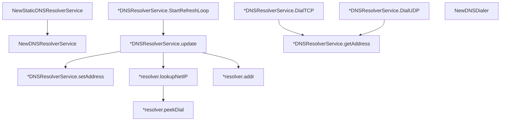

# Behavior Atom: ingress/origins/dns.go

## Source Anchor

- Go source: [cloudflare/cloudflared@2026.3.0/ingress/origins/dns.go](https://github.com/cloudflare/cloudflared/blob/2026.3.0/ingress/origins/dns.go)
- Package: origins
- Module group: ingress

## Behavioral Responsibility

Provides DNS origin dialing behavior through `DNSResolverService`, including protocol-specific dialing (`DialTCP`, `DialUDP`) and background refresh of local resolver address state.

## Entry Points

- NewDNSResolverService(dialer ingress.OriginDialer, logger *zerolog.Logger, metrics Metrics)*DNSResolverService (line 57)
- NewStaticDNSResolverService(resolverAddrs []netip.AddrPort, dialer ingress.OriginDialer, logger *zerolog.Logger, metrics Metrics)*DNSResolverService (line 67)
- (*DNSResolverService) DialTCP(ctx context.Context, _ netip.AddrPort) (net.Conn, error) (line 74)
- (*DNSResolverService) DialUDP(_ netip.AddrPort) (net.Conn, error) (line 81)
- (*DNSResolverService) StartRefreshLoop(ctx context.Context) (line 91)
- NewDNSDialer() *ingress.Dialer (line 207)

## Internal Function Surface

- (*DNSResolverService) update(ctx context.Context) error (line 114)
- (*DNSResolverService) getAddress() netip.AddrPort (line 142)
- (*DNSResolverService) setAddress(addr netip.AddrPort) (line 164)
- (*resolver) addr() (network string, address string) (line 187)
- (*resolver) lookupNetIP(ctx context.Context, host string) ([]netip.Addr, error) (line 191)
- (*resolver) peekDial(ctx context.Context, network string, address string) (net.Conn, error) (line 200)

## Input/Output Contract

- func-param:_ netip.AddrPort
- func-param:addr netip.AddrPort
- func-param:address string
- func-param:ctx context.Context
- func-param:dialer ingress.OriginDialer
- func-param:host string
- func-param:logger *zerolog.Logger
- func-param:metrics Metrics
- func-param:network string
- func-param:resolverAddrs []netip.AddrPort
- constant:VirtualDNSServiceAddr = 2606:4700:0cf1:2000::1:53
- constant:defaultLookupHost = region1.v2.argotunnel.com
- scheduler:refreshFreq = 5 minutes
- metrics emission
- return:*DNSResolverService
- return:*ingress.Dialer
- return:[]netip.Addr
- return:address string
- return:error
- return:net.Conn
- return:netip.AddrPort
- return:network string
- stdout/stderr or structured logs

## Dependencies

- context
- crypto/rand
- github.com/cloudflare/cloudflared/ingress
- github.com/rs/zerolog
- math/big
- net
- net/netip
- slices
- sync
- time
- [ingress/origins/metrics](metrics.md) (defines `Metrics`; no crypto imports)

## Go-Impl Flow (Intra-file)

## Rust Porting Notes

- **Background refresh loop**: `StartRefreshLoop` goroutine refreshing every 5min → `tokio::spawn` + `tokio::time::interval(Duration::from_secs(300))` loop.
- **Randomized resolver selection**: `crypto/rand` to pick resolver index → `rand::thread_rng().gen_range(0..resolvers.len())`.
- **DNS resolution**: `net.Resolver` with custom dialer → `hickory_resolver::TokioAsyncResolver` with custom config.
- **Quirk — background goroutine**: Must handle graceful shutdown via `CancellationToken` or `watch` channel.

## Accuracy Notes

- Generated from Go AST parsing and source text pattern extraction.
- Source link is authoritative for disputed semantics; keep this atom synchronized with the linked file.
- `getAddress` uses `crypto/rand` to choose a resolver index only when multiple resolver addresses are configured; source comments state this selection is not security-sensitive and uses crypto rand for linter compliance.
- `StartRefreshLoop` runs in the background and refreshes resolver state every 5 minutes by resolving `region1.v2.argotunnel.com`.
