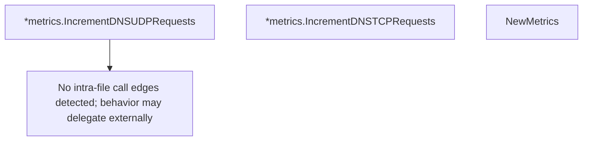

# Behavior Atom: ingress/origins/metrics.go

## Source Anchor

- Go source: [cloudflare/cloudflared@2026.3.0/ingress/origins/metrics.go](https://github.com/cloudflare/cloudflared/blob/2026.3.0/ingress/origins/metrics.go)
- Package: origins
- Module group: ingress

## Behavioral Responsibility

Ingress matching and origin dispatch behavior.

## Entry Points

- (*metrics) IncrementDNSUDPRequests() (line 21)
- (*metrics) IncrementDNSTCPRequests() (line 25)
- NewMetrics(registerer prometheus.Registerer) Metrics (line 29)

## Internal Function Surface

- None detected.

## Input Contract

- func-param:registerer prometheus.Registerer

## Output Contract

- metrics emission
- return:Metrics

## Side Effects and State Transitions

- No high-signal side effect pattern detected in static scan.

## Branching and Failure Semantics

- Branch density: if=0, switch=0, select=0
- No explicit failure pattern markers found in static scan.

## Import and Dependency Surface

- github.com/prometheus/client_golang/prometheus

## Go-Impl Flow (Intra-file)

## Rust Porting Notes

- **Simple metric wrapper**: Prometheus counter/histogram registration → `once_cell::sync::Lazy<prometheus::HistogramVec>` or `LazyLock`.
- **Quirk — zero branching**: Pure metric definitions; direct translation.

## Accuracy Notes

- Generated from Go AST parsing and source text pattern extraction.
- Source link is authoritative for disputed semantics; keep this atom synchronized with the linked file.
