# Behavior Atom: ingress/packet_router.go

## Source Anchor

- Go source: [cloudflare/cloudflared@2026.3.0/ingress/packet_router.go](https://github.com/cloudflare/cloudflared/blob/2026.3.0/ingress/packet_router.go)
- Package: ingress
- Module group: ingress

## Behavioral Responsibility

Ingress matching and origin dispatch behavior.

## Entry Points

- NewPacketRouter(icmpRouter ICMPRouter, muxer muxer, connIndex uint8, logger *zerolog.Logger)*PacketRouter (line 34)
- (*PacketRouter) Serve(ctx context.Context) error (line 45)
- (*packetResponder) ConnectionIndex() uint8 (line 140)
- (*packetResponder) ReturnPacket(pk*packet.ICMP) error (line 144)
- (*packetResponder) AddTraceContext(tracedCtx*tracing.TracedContext, serializedIdentity []byte) (line 153)
- (*packetResponder) RequestSpan(ctx context.Context, pk*packet.ICMP) (context.Context, trace.Span) (line 158)
- (*packetResponder) ReplySpan(ctx context.Context, logger*zerolog.Logger) (context.Context, trace.Span) (line 168)
- (*packetResponder) ExportSpan() (line 175)

## Internal Function Surface

- (*PacketRouter) nextPacket(ctx context.Context) (packet.RawPacket, ICMPResponder, error) (line 55)
- (*PacketRouter) handlePacket(ctx context.Context, rawPacket packet.RawPacket, responder ICMPResponder) (line 79)
- (*PacketRouter) sendTTLExceedMsg(pk*packet.ICMP, rawPacket packet.RawPacket) error (line 108)
- newPacketResponder(datagramMuxer muxer, connIndex uint8, encoder *packet.Encoder) ICMPResponder (line 128)
- (*packetResponder) tracingEnabled() bool (line 136)

## Input Contract

- func-param:connIndex uint8
- func-param:ctx context.Context
- func-param:datagramMuxer muxer
- func-param:encoder *packet.Encoder
- func-param:icmpRouter ICMPRouter
- func-param:logger *zerolog.Logger
- func-param:muxer muxer
- func-param:pk *packet.ICMP
- func-param:rawPacket packet.RawPacket
- func-param:responder ICMPResponder
- func-param:serializedIdentity []byte
- func-param:tracedCtx *tracing.TracedContext

## Output Contract

- return:*PacketRouter
- return:ICMPResponder
- return:bool
- return:context.Context
- return:error
- return:packet.RawPacket
- return:trace.Span
- return:uint8
- stdout/stderr or structured logs

## Side Effects and State Transitions

- network I/O

## Branching and Failure Semantics

- Branch density: if=14, switch=1, select=0
- error-return paths
- fallback/default branches

## Import and Dependency Surface

- context
- fmt
- github.com/cloudflare/cloudflared/packet
- github.com/cloudflare/cloudflared/quic
- github.com/cloudflare/cloudflared/tracing
- github.com/rs/zerolog
- go.opentelemetry.io/otel/attribute
- go.opentelemetry.io/otel/trace

## Go-Impl Flow (Intra-file)

```mermaid
flowchart TD
    F1["NewPacketRouter"]
    F2["*PacketRouter.Serve"]
    F3["*PacketRouter.nextPacket"]
    F4["*PacketRouter.handlePacket"]
    F5["*PacketRouter.sendTTLExceedMsg"]
    F6["newPacketResponder"]
    F7["*packetResponder.tracingEnabled"]
    F8["*packetResponder.ConnectionIndex"]
    F9["*packetResponder.ReturnPacket"]
    F10["*packetResponder.AddTraceContext"]
    F11["*packetResponder.RequestSpan"]
    F12["*packetResponder.ReplySpan"]
    F13["*packetResponder.ExportSpan"]
    F3 --> F6
```

## Rust Porting Notes

- **OpenTelemetry span propagation**: Extracts/injects trace context across packet boundaries → `opentelemetry::Context::current()` + `tracing_opentelemetry` layer.
- **Packet routing**: Demux based on packet type/destination → `match packet.packet_type() { ... }` dispatch to handlers.
- **Quirk — 14 if-branches + 1 switch**: Packet type dispatch + error handling; use `match` with exhaustive arms.

## Accuracy Notes

- Generated from Go AST parsing and source text pattern extraction.
- Source link is authoritative for disputed semantics; keep this atom synchronized with the linked file.
