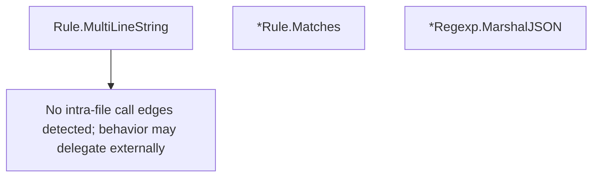

# Behavior Atom: ingress/rule.go

## Source Anchor

- Go source: [cloudflare/cloudflared@2026.3.0/ingress/rule.go](https://github.com/cloudflare/cloudflared/blob/2026.3.0/ingress/rule.go)
- Package: ingress
- Module group: ingress

## Behavioral Responsibility

Ingress matching and origin dispatch behavior.

## Entry Points

- (Rule) MultiLineString() string (line 37)
- (*Rule) Matches(hostname string, path string) bool (line 55)
- (*Regexp) MarshalJSON() ([]byte, error) (line 75)

## Internal Function Surface

- None detected.

## Input Contract

- func-param:hostname string
- func-param:path string

## Output Contract

- return:[]byte
- return:bool
- return:error
- return:string

## Side Effects and State Transitions

- No high-signal side effect pattern detected in static scan.

## Branching and Failure Semantics

- Branch density: if=5, switch=0, select=0
- No explicit failure pattern markers found in static scan.

## Import and Dependency Surface

- encoding/json
- github.com/cloudflare/cloudflared/ingress/middleware
- regexp
- strings

## Go-Impl Flow (Intra-file)

## Rust Porting Notes

- **Regexp compilation**: `regexp.Compile()` for hostname rules → `regex::Regex::new()` (compile once, store in rule struct).
- **Custom JSON marshaling**: `MarshalJSON`/`UnmarshalJSON` for rule types → `impl Serialize`/`impl Deserialize` with `#[serde(rename_all, ...)]`.
- **Quirk — 5 if-branches**: Rule matching + validation; straightforward `match`.

## Accuracy Notes

- Generated from Go AST parsing and source text pattern extraction.
- Source link is authoritative for disputed semantics; keep this atom synchronized with the linked file.
