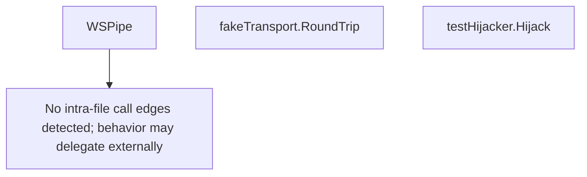

# Behavior Atom: internal/test/wstest.go

## Source Anchor

- Go source: [cloudflare/cloudflared@2026.3.0/internal/test/wstest.go](https://github.com/cloudflare/cloudflared/blob/2026.3.0/internal/test/wstest.go)
- Package: test
- Module group: internal

## Behavioral Responsibility

Core package behavior anchored to this source file.

## Entry Points

- WSPipe(dialOpts *websocket.DialOptions, acceptOpts*websocket.AcceptOptions) (clientConn *websocket.Conn, serverConn*websocket.Conn) (line 17)
- (fakeTransport) RoundTrip(r *http.Request) (*http.Response, error) (line 40)
- (testHijacker) Hijack() (net.Conn, *bufio.ReadWriter, error) (line 64)

## Internal Function Surface

- None detected.

## Input Contract

- HTTP requests
- func-param:acceptOpts *websocket.AcceptOptions
- func-param:dialOpts *websocket.DialOptions
- func-param:r *http.Request

## Output Contract

- HTTP response writes
- return:*bufio.ReadWriter
- return:*http.Response
- return:clientConn *websocket.Conn
- return:error
- return:net.Conn
- return:serverConn *websocket.Conn

## Side Effects and State Transitions

- network I/O

## Branching and Failure Semantics

- Branch density: if=2, switch=0, select=0
- No explicit failure pattern markers found in static scan.

## Import and Dependency Surface

- bufio
- context
- net
- net/http
- net/http/httptest
- nhooyr.io/websocket

## Go-Impl Flow (Intra-file)

## Rust Porting Notes

- **Test WebSocket helper**: `nhooyr.io/websocket` test server with `http.Hijacker` → `tokio_tungstenite::accept_async()` in test, or `axum::extract::ws` for test server.
- **Quirk — 2 if-branches**: Test-only; lower priority for production port.

## Accuracy Notes

- Generated from Go AST parsing and source text pattern extraction.
- Source link is authoritative for disputed semantics; keep this atom synchronized with the linked file.
