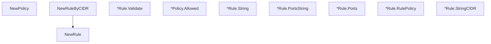

# Behavior Atom: ipaccess/access.go

## Source Anchor

- Go source: [cloudflare/cloudflared@2026.3.0/ipaccess/access.go](https://github.com/cloudflare/cloudflared/blob/2026.3.0/ipaccess/access.go)
- Package: ipaccess
- Module group: ipaccess

## Behavioral Responsibility

Core package behavior anchored to this source file.

## Entry Points

- NewPolicy(defaultAllow bool, rules []Rule) (*Policy, error) (line 20)
- NewRuleByCIDR(prefix *string, ports []int, allow bool) (Rule, error) (line 35)
- NewRule(ipnet *net.IPNet, ports []int, allow bool) (Rule, error) (line 48)
- (*Rule) Validate() error (line 57)
- (*Policy) Allowed(ip net.IP, port int) (bool,*Rule) (line 74)
- (*Rule) String() string (line 92)
- (*Rule) PortsString() string (line 96)
- (*Rule) Ports() []int (line 103)
- (*Rule) RulePolicy() bool (line 107)
- (*Rule) StringCIDR() string (line 111)

## Internal Function Surface

- None detected.

## Input Contract

- func-param:allow bool
- func-param:defaultAllow bool
- func-param:ip net.IP
- func-param:ipnet *net.IPNet
- func-param:port int
- func-param:ports []int
- func-param:prefix *string
- func-param:rules []Rule

## Output Contract

- return:*Policy
- return:*Rule
- return:Rule
- return:[]int
- return:bool
- return:error
- return:string

## Side Effects and State Transitions

- network I/O

## Branching and Failure Semantics

- Branch density: if=11, switch=0, select=0
- error-return paths

## Import and Dependency Surface

- fmt
- net
- sort

## Go-Impl Flow (Intra-file)

## Rust Porting Notes

- **IP/CIDR matching**: `net.IPNet.Contains()` for access control rules → `ipnet::IpNet::contains()` from `ipnet` crate.
- **Rule ordering**: `sort.Slice` on policy rules → `Vec::sort_by()` with custom comparator.
- **Quirk — 11 if-branches**: Rule matching logic; use iterator `.find()` or `.any()` patterns.

## Accuracy Notes

- Generated from Go AST parsing and source text pattern extraction.
- Source link is authoritative for disputed semantics; keep this atom synchronized with the linked file.
