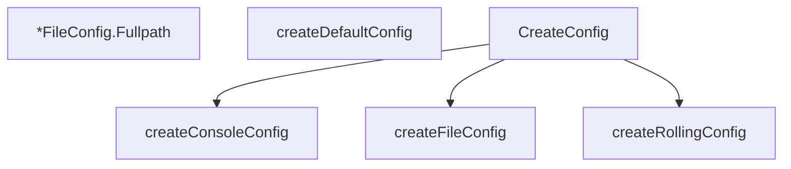

# Behavior Atom: logger/configuration.go

## Source Anchor

- Go source: [cloudflare/cloudflared@2026.3.0/logger/configuration.go](https://github.com/cloudflare/cloudflared/blob/2026.3.0/logger/configuration.go)
- Package: logger
- Module group: logger

## Behavioral Responsibility

Core package behavior anchored to this source file.

## Entry Points

- (*FileConfig) Fullpath() string (line 28)
- CreateConfig(minLevel string, disableTerminal bool, formatJSON bool, rollingLogPath string, nonRollingLogFilePath string) *Config (line 69)

## Internal Function Surface

- createDefaultConfig() Config (line 41)
- createConsoleConfig(formatJSON bool) *ConsoleConfig (line 101)
- createFileConfig(fullpath string) *FileConfig (line 108)
- createRollingConfig(directory string) *RollingConfig (line 121)

## Input Contract

- func-param:directory string
- func-param:disableTerminal bool
- func-param:formatJSON bool
- func-param:fullpath string
- func-param:minLevel string
- func-param:nonRollingLogFilePath string
- func-param:rollingLogPath string

## Output Contract

- return:*Config
- return:*ConsoleConfig
- return:*FileConfig
- return:*RollingConfig
- return:Config
- return:string

## Side Effects and State Transitions

- No high-signal side effect pattern detected in static scan.

## Branching and Failure Semantics

- Branch density: if=6, switch=0, select=0
- No explicit failure pattern markers found in static scan.

## Import and Dependency Surface

- path/filepath

## Go-Impl Flow (Intra-file)

## Rust Porting Notes

- **Config construction**: Logger config with path/level/rolling options → Rust struct with builder pattern or `Default` impl.
- **Quirk — 6 if-branches**: Option defaulting; use `Option::unwrap_or()` chains.

## Accuracy Notes

- Generated from Go AST parsing and source text pattern extraction.
- Source link is authoritative for disputed semantics; keep this atom synchronized with the linked file.
