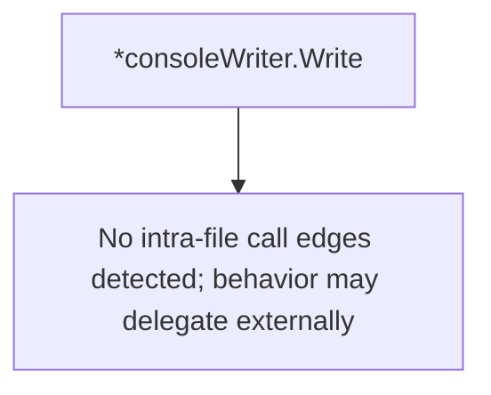

# Behavior Atom: logger/console.go

## Source Anchor

- Go source: [cloudflare/cloudflared@2026.3.0/logger/console.go](https://github.com/cloudflare/cloudflared/blob/2026.3.0/logger/console.go)
- Package: logger
- Module group: logger

## Behavioral Responsibility

Core package behavior anchored to this source file.

## Entry Points

- (*consoleWriter) Write(p []byte) (n int, err error) (line 27)

## Internal Function Surface

- None detected.

## Input Contract

- func-param:p []byte

## Output Contract

- return:err error
- return:n int
- stdout/stderr or structured logs

## Side Effects and State Transitions

- No high-signal side effect pattern detected in static scan.

## Branching and Failure Semantics

- Branch density: if=1, switch=0, select=0
- error-return paths

## Import and Dependency Surface

- bytes
- fmt
- github.com/json-iterator/go
- io

## Go-Impl Flow (Intra-file)

## Rust Porting Notes

- **Custom io.Writer**: JSON-aware console writer using `json-iterator/go` → `impl std::io::Write` with `serde_json` for structured log formatting.
- **Quirk — 1 if-branch**: Minimal; direct translation.

## Accuracy Notes

- Generated from Go AST parsing and source text pattern extraction.
- Source link is authoritative for disputed semantics; keep this atom synchronized with the linked file.
