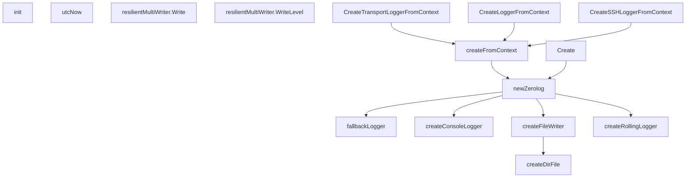

# Behavior Atom: logger/create.go

## Source Anchor

- Go source: [cloudflare/cloudflared@2026.3.0/logger/create.go](https://github.com/cloudflare/cloudflared/blob/2026.3.0/logger/create.go)
- Package: logger
- Module group: logger

## Behavioral Responsibility

Core package behavior anchored to this source file.

## Entry Points

- init() (line 36)
- (resilientMultiWriter) Write(p []byte) (n int, err error) (line 63)
- (resilientMultiWriter) WriteLevel(level zerolog.Level, p []byte) (n int, err error) (line 73)
- CreateTransportLoggerFromContext(c *cli.Context, disableTerminal bool)*zerolog.Logger (line 131)
- CreateLoggerFromContext(c *cli.Context, disableTerminal bool)*zerolog.Logger (line 135)
- CreateSSHLoggerFromContext(c *cli.Context, disableTerminal bool)*zerolog.Logger (line 139)
- Create(loggerConfig *Config)*zerolog.Logger (line 178)

## Internal Function Surface

- utcNow() time.Time (line 43)
- fallbackLogger(err error) *zerolog.Logger (line 47)
- newZerolog(loggerConfig *Config)*zerolog.Logger (line 89)
- createFromContext(c *cli.Context, logLevelFlagName string, logDirectoryFlagName string, disableTerminal bool)*zerolog.Logger (line 143)
- createConsoleLogger(config ConsoleConfig) io.Writer (line 190)
- createFileWriter(config FileConfig) (io.Writer, error) (line 213)
- createDirFile(config FileConfig) (io.Writer, error) (line 237)
- createRollingLogger(config RollingConfig) (io.Writer, error) (line 257)

## Input Contract

- CLI flags and command arguments
- func-param:c *cli.Context
- func-param:config ConsoleConfig
- func-param:config FileConfig
- func-param:config RollingConfig
- func-param:disableTerminal bool
- func-param:err error
- func-param:level zerolog.Level
- func-param:logDirectoryFlagName string
- func-param:logLevelFlagName string
- func-param:loggerConfig *Config
- func-param:p []byte

## Output Contract

- HTTP response writes
- return:*zerolog.Logger
- return:err error
- return:error
- return:io.Writer
- return:n int
- return:time.Time
- stdout/stderr or structured logs

## Side Effects and State Transitions

- filesystem I/O
- concurrency primitives

## Branching and Failure Semantics

- Branch density: if=19, switch=1, select=0
- error-return paths
- fallback/default branches

## Import and Dependency Surface

- fmt
- github.com/cloudflare/cloudflared/cmd/cloudflared/flags
- github.com/cloudflare/cloudflared/management
- github.com/mattn/go-colorable
- github.com/rs/zerolog
- github.com/rs/zerolog/log
- github.com/urfave/cli/v2
- golang.org/x/term
- gopkg.in/natefinch/lumberjack.v2
- io
- os
- path/filepath
- sync
- time

## Go-Impl Flow (Intra-file)

## Rust Porting Notes

- **init() global state**: Package-level `init()` configuring default logger → `once_cell::sync::Lazy` or `tracing_subscriber::init()` called once.
- **Rolling log files**: `lumberjack` for log rotation → `tracing_appender::rolling::daily()` or `file-rotate` crate.
- **CLI flag parsing**: `urfave/cli` for log level flags → `clap` derive struct.
- **Colorized output**: `go-colorable` → `tracing_subscriber::fmt::SubscriberBuilder::with_ansi()`.
- **Quirk — 19 if + 1 switch**: Heavy config branching; decompose into smaller setup functions.

## Accuracy Notes

- Generated from Go AST parsing and source text pattern extraction.
- Source link is authoritative for disputed semantics; keep this atom synchronized with the linked file.
