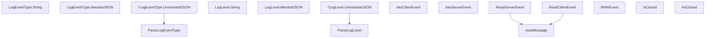

# Behavior Atom: management/events.go

## Source Anchor

- Go source: [cloudflare/cloudflared@2026.3.0/management/events.go](https://github.com/cloudflare/cloudflared/blob/2026.3.0/management/events.go)
- Package: management
- Module group: management

## Behavioral Responsibility

Management, diagnostics, and observability behavior.

## Entry Points

- ParseLogEventType(s string) (LogEventType, bool) (line 85)
- (LogEventType) String() string (line 99)
- (LogEventType) MarshalJSON() ([]byte, error) (line 114)
- (*LogEventType) UnmarshalJSON(data []byte) error (line 118)
- ParseLogLevel(l string) (LogLevel, bool) (line 142)
- (LogLevel) String() string (line 156)
- (LogLevel) MarshalJSON() ([]byte, error) (line 171)
- (*LogLevel) UnmarshalJSON(data []byte) error (line 175)
- IntoClientEvent(e *ClientEvent, eventType ClientEventType) (*T, bool) (line 210)
- IntoServerEvent(e *ServerEvent, eventType ServerEventType) (*T, bool) (line 223)
- ReadServerEvent(c *websocket.Conn, ctx context.Context) (*ServerEvent, error) (line 236)
- ReadClientEvent(c *websocket.Conn, ctx context.Context) (*ClientEvent, error) (line 257)
- WriteEvent(c *websocket.Conn, ctx context.Context, event any) error (line 290)
- IsClosed(err error, log *zerolog.Logger) bool (line 300)
- AsClosed(err error) *websocket.CloseError (line 311)

## Internal Function Surface

- readMessage(c *websocket.Conn, ctx context.Context) ([]byte, error) (line 278)

## Input Contract

- func-param:c *websocket.Conn
- func-param:ctx context.Context
- func-param:data []byte
- func-param:e *ClientEvent
- func-param:e *ServerEvent
- func-param:err error
- func-param:event any
- func-param:eventType ClientEventType
- func-param:eventType ServerEventType
- func-param:l string
- func-param:log *zerolog.Logger
- func-param:s string
- serialized configuration payloads

## Output Contract

- HTTP response writes
- return:*ClientEvent
- return:*ServerEvent
- return:*T
- return:*websocket.CloseError
- return:LogEventType
- return:LogLevel
- return:[]byte
- return:bool
- return:error
- return:string
- stdout/stderr or structured logs

## Side Effects and State Transitions

- network I/O

## Branching and Failure Semantics

- Branch density: if=18, switch=6, select=0
- error-return paths
- fallback/default branches

## Import and Dependency Surface

- context
- errors
- fmt
- github.com/json-iterator/go
- github.com/rs/zerolog
- io
- nhooyr.io/websocket

## Go-Impl Flow (Intra-file)

## Accuracy Notes

- Generated from Go AST parsing and source text pattern extraction.
- Source link is authoritative for disputed semantics; keep this atom synchronized with the linked file.

## Rust Porting Notes

- **Event type system**: `LogEventType`/`LogLevel` iota enums → `#[derive(Serialize, Deserialize)]` Rust enums with `#[serde(rename_all = "lowercase")]`.
- **Generic event dispatch**: `IntoClientEvent[T]`/`IntoServerEvent[T]` Go generics → Rust enum variants with typed payloads, or `serde_json::from_value` downcasting.
- **WebSocket read/write**: `nhooyr.io/websocket` → `tokio-tungstenite::Message` or `axum::extract::ws::Message` with JSON serialization.
- **JSON codec**: `json-iterator/go` for fast JSON → `serde_json` (already fast for Rust); no special codec needed.
- **Close detection**: `IsClosed`/`AsClosed` error matching → match on `tungstenite::Error::ConnectionClosed` or `Protocol(ResetWithoutClosingHandshake)`.
- **Quirk — 6 switch statements**: Heavy switch-based parsing for event types and log levels → derive `FromStr`/`Display` via `strum` crate or manual `match` on string slices.
- **Quirk — WriteEvent accepts `any`**: Untyped event serialization → in Rust, use a `ServerEvent` enum that implements `Serialize` for type-safe event emission.
