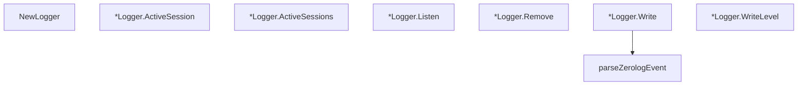

# Behavior Atom: management/logger.go

## Source Anchor

- Go source: [cloudflare/cloudflared@2026.3.0/management/logger.go](https://github.com/cloudflare/cloudflared/blob/2026.3.0/management/logger.go)
- Package: management
- Module group: management

## Behavioral Responsibility

Management, diagnostics, and observability behavior.

## Entry Points

- NewLogger() *Logger (line 25)
- (*Logger) ActiveSession(actor actor)*session (line 46)
- (*Logger) ActiveSessions() int (line 57)
- (*Logger) Listen(session*session) (line 69)
- (*Logger) Remove(session*session) (line 76)
- (*Logger) Write(p []byte) (int, error) (line 97)
- (*Logger) WriteLevel(level zerolog.Level, p []byte) (n int, err error) (line 116)

## Internal Function Surface

- parseZerologEvent(p []byte) (*Log, error) (line 120)

## Input Contract

- func-param:actor actor
- func-param:level zerolog.Level
- func-param:p []byte
- func-param:session *session

## Output Contract

- HTTP response writes
- return:*Log
- return:*Logger
- return:*session
- return:err error
- return:error
- return:int
- return:n int
- stdout/stderr or structured logs

## Side Effects and State Transitions

- network I/O
- concurrency primitives

## Branching and Failure Semantics

- Branch density: if=17, switch=0, select=0
- error-return paths

## Import and Dependency Surface

- github.com/json-iterator/go
- github.com/rs/zerolog
- os
- sync
- time

## Go-Impl Flow (Intra-file)

## Rust Porting Notes

- **Mutex-protected sessions**: `sync.Mutex` guarding session writer map → `Arc<RwLock<HashMap<SessionId, Sender<LogEvent>>>>` or `DashMap`.
- **LevelWriter interface**: `zerolog.LevelWriter` for level-filtered writing → custom `tracing_subscriber::Layer` with per-level dispatch.
- **Quirk — 17 if-branches**: Session lifecycle checks; use `match` on session state enum.

## Accuracy Notes

- Generated from Go AST parsing and source text pattern extraction.
- Source link is authoritative for disputed semantics; keep this atom synchronized with the linked file.
