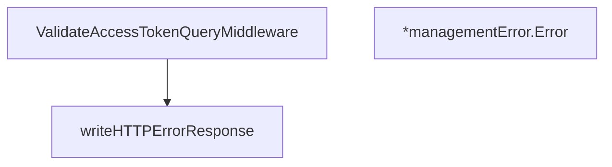

# Behavior Atom: management/middleware.go

## Source Anchor

- Go source: [cloudflare/cloudflared@2026.3.0/management/middleware.go](https://github.com/cloudflare/cloudflared/blob/2026.3.0/management/middleware.go)
- Package: management
- Module group: management

## Behavioral Responsibility

Management, diagnostics, and observability behavior.

## Entry Points

- ValidateAccessTokenQueryMiddleware(next http.Handler) http.Handler (line 18)
- (*managementError) Error() string (line 42)

## Internal Function Surface

- writeHTTPErrorResponse(w http.ResponseWriter, errResp managementError) (line 53)

## Input Contract

- HTTP requests
- func-param:errResp managementError
- func-param:next http.Handler
- func-param:w http.ResponseWriter

## Output Contract

- HTTP response writes
- return:http.Handler
- return:string

## Side Effects and State Transitions

- network I/O

## Branching and Failure Semantics

- Branch density: if=3, switch=0, select=0
- error-return paths

## Import and Dependency Surface

- context
- fmt
- net/http

## Go-Impl Flow (Intra-file)

## Rust Porting Notes

- **Context value extraction**: `context.WithValue` for request-scoped data → `axum::extract::Extension` or `tower::Layer` with request extensions.
- **Quirk — 3 if-branches**: Auth check; straightforward middleware guard.

## Accuracy Notes

- Generated from Go AST parsing and source text pattern extraction.
- Source link is authoritative for disputed semantics; keep this atom synchronized with the linked file.
