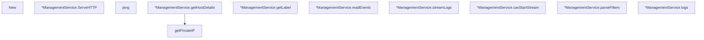

# Behavior Atom: management/service.go

## Source Anchor

- Go source: [cloudflare/cloudflared@2026.3.0/management/service.go](https://github.com/cloudflare/cloudflared/blob/2026.3.0/management/service.go)
- Package: management
- Module group: management

## Behavioral Responsibility

Management, diagnostics, and observability behavior.

## Entry Points

- New(managementHostname string, enableDiagServices bool, serviceIP string, clientID uuid.UUID, label string, log *zerolog.Logger, logger LoggerListener)*ManagementService (line 67)
- (*ManagementService) ServeHTTP(w http.ResponseWriter, r*http.Request) (line 105)

## Internal Function Surface

- ping(w http.ResponseWriter, r *http.Request) (line 110)
- (*ManagementService) getHostDetails(w http.ResponseWriter, r*http.Request) (line 121)
- (*ManagementService) getLabel() string (line 135)
- getPrivateIP(addr string) (string, error) (line 150)
- (*ManagementService) readEvents(c*websocket.Conn, ctx context.Context, events chan<- *ClientEvent) (line 164)
- (*ManagementService) streamLogs(c*websocket.Conn, ctx context.Context, session *session) (line 186)
- (*ManagementService) canStartStream(session*session) bool (line 214)
- (*ManagementService) parseFilters(c*websocket.Conn, event *ClientEvent, session*session) bool (line 237)
- (*ManagementService) logs(w http.ResponseWriter, r*http.Request) (line 248)

## Input Contract

- HTTP requests
- func-param:addr string
- func-param:c *websocket.Conn
- func-param:clientID uuid.UUID
- func-param:ctx context.Context
- func-param:enableDiagServices bool
- func-param:event *ClientEvent
- func-param:events chan<- *ClientEvent
- func-param:label string
- func-param:log *zerolog.Logger
- func-param:logger LoggerListener
- func-param:managementHostname string
- func-param:r *http.Request
- func-param:serviceIP string
- func-param:session *session
- func-param:w http.ResponseWriter

## Output Contract

- HTTP response writes
- metrics emission
- return:*ManagementService
- return:bool
- return:error
- return:string
- stdout/stderr or structured logs

## Side Effects and State Transitions

- network I/O
- subprocess execution
- concurrency primitives
- timers and scheduling

## Branching and Failure Semantics

- Branch density: if=17, switch=1, select=3
- error-return paths
- fallback/default branches

## Import and Dependency Surface

- context
- fmt
- github.com/go-chi/chi/v5
- github.com/go-chi/cors
- github.com/google/uuid
- github.com/prometheus/client_golang/prometheus/promhttp
- github.com/rs/zerolog
- net
- net/http
- net/http/pprof
- nhooyr.io/websocket
- os
- sync
- time

## Go-Impl Flow (Intra-file)

## Accuracy Notes

- Generated from Go AST parsing and source text pattern extraction.
- Source link is authoritative for disputed semantics; keep this atom synchronized with the linked file.

## Rust Porting Notes

- **HTTP router**: `go-chi/chi` mux → `axum::Router` with method-based routing and extractors.
- **CORS middleware**: `go-chi/cors` → `tower_http::cors::CorsLayer` configured on the axum router.
- **WebSocket handling**: `nhooyr.io/websocket` → `axum::extract::ws::WebSocketUpgrade` or `tokio-tungstenite` for the log-streaming endpoint.
- **Event channel**: `chan<- *ClientEvent` → `tokio::sync::mpsc::Sender<ClientEvent>`; `readEvents` goroutine → `tokio::spawn` task reading from WebSocket.
- **Session tracking**: `sync.Mutex`-guarded session state → `tokio::sync::Mutex` or `dashmap::DashMap` for concurrent session access.
- **Prometheus handler**: `promhttp.Handler()` → `metrics_exporter_prometheus` or `axum_prometheus` middleware.
- **Pprof endpoints**: Go `net/http/pprof` → `pprof` crate or custom `/debug/` handlers; may be omitted if replaced by `tokio-console`.
- **Quirk — canStartStream guard**: Rate-limits concurrent log streams via a mutex-guarded counter; the Rust port should use `Arc<Semaphore>` for backpressure instead of manual counting.
- **Quirk — getPrivateIP**: Extracts private IP from `net.Conn.RemoteAddr()` string parsing — in Rust, use `SocketAddr` typed extraction to avoid string-parse fragility.
