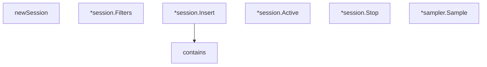

# Behavior Atom: management/session.go

## Source Anchor

- Go source: [cloudflare/cloudflared@2026.3.0/management/session.go](https://github.com/cloudflare/cloudflared/blob/2026.3.0/management/session.go)
- Package: management
- Module group: management

## Behavioral Responsibility

Management, diagnostics, and observability behavior.

## Entry Points

- (*session) Filters(filters*StreamingFilters) (line 46)
- (*session) Insert(log*Log) (line 70)
- (*session) Active() bool (line 93)
- (*session) Stop() (line 98)
- (*sampler) Sample() bool (line 117)

## Internal Function Surface

- newSession(size int, actor actor, cancel context.CancelFunc) *session (line 34)
- contains(array []LogEventType, t LogEventType) bool (line 102)

## Input Contract

- func-param:actor actor
- func-param:array []LogEventType
- func-param:cancel context.CancelFunc
- func-param:filters *StreamingFilters
- func-param:log *Log
- func-param:size int
- func-param:t LogEventType

## Output Contract

- return:*session
- return:bool
- stdout/stderr or structured logs

## Side Effects and State Transitions

- network I/O
- concurrency primitives

## Branching and Failure Semantics

- Branch density: if=9, switch=0, select=1
- fallback/default branches

## Import and Dependency Surface

- context
- math/rand
- sync/atomic

## Go-Impl Flow (Intra-file)

## Accuracy Notes

- Generated from Go AST parsing and source text pattern extraction.
- Source link is authoritative for disputed semantics; keep this atom synchronized with the linked file.

## Rust Porting Notes

- **Session state**: Mutable session with filters → `Arc<Mutex<SessionState>>` or `tokio::sync::watch::Sender<StreamingFilters>` for lock-free filter updates.
- **Log ring buffer**: `Insert` adds log to bounded buffer → `crossbeam::queue::ArrayQueue` or `VecDeque` with capacity limit.
- **Atomic active flag**: `sync/atomic` for `Active()` check → `std::sync::atomic::AtomicBool` with `Ordering::Relaxed`.
- **Sampler**: Probabilistic `Sample()` method → `rand::Rng::gen_ratio(numerator, denominator)` for equivalent probability sampling.
- **Select on filter update**: Single `select` for filter changes → `tokio::sync::watch::Receiver::changed().await` for reactive filter propagation.
- **Quirk — 9 if-branches**: Log level filtering and sampling logic — keep as simple conditionals; no decomposition needed.
