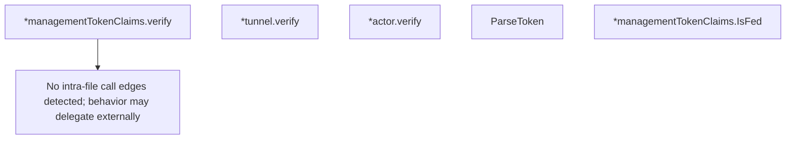

# Behavior Atom: management/token.go

## Source Anchor

- Go source: [cloudflare/cloudflared@2026.3.0/management/token.go](https://github.com/cloudflare/cloudflared/blob/2026.3.0/management/token.go)
- Package: management
- Module group: management

## Behavioral Responsibility

Management, diagnostics, and observability behavior.

## Entry Points

- ParseToken(token string) (*managementTokenClaims, error) (line 43)
- (*managementTokenClaims) IsFed() bool (line 61)

## Internal Function Surface

- (*managementTokenClaims) verify() bool (line 19)
- (*tunnel) verify() bool (line 29)
- (*actor) verify() bool (line 39)

## Input Contract

- func-param:token string

## Output Contract

- return:*managementTokenClaims
- return:bool
- return:error

## Side Effects and State Transitions

- No high-signal side effect pattern detected in static scan.

## Branching and Failure Semantics

- Branch density: if=3, switch=0, select=0
- error-return paths

## Import and Dependency Surface

- fmt
- github.com/go-jose/go-jose/v4
- github.com/go-jose/go-jose/v4/jwt

## Go-Impl Flow (Intra-file)

## Accuracy Notes

- Generated from Go AST parsing and source text pattern extraction.
- Source link is authoritative for disputed semantics; keep this atom synchronized with the linked file.

## Rust Porting Notes

- **JWT parsing**: `go-jose/v4/jwt` → `jsonwebtoken` crate with `decode` and `Validation` for claim extraction.
- **JOSE library**: `go-jose/v4` JWS/JWE → `jsonwebtoken` handles JWS natively; for JWE, use `josekit` crate.
- **Token claims**: `managementTokenClaims` struct → `#[derive(Deserialize)]` struct with `exp`, `iss`, `sub`, and custom `is_fed` fields.
- **FedRAMP detection**: `IsFed()` checks issuer claim → simple string comparison on the `iss` field; no special crate needed.
- **Quirk — unsigned token parsing**: Go code parses without signature verification in some paths — the Rust port must decide whether to use `dangerous_insecure_decode` or enforce signature validation.
