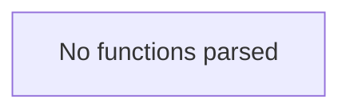

# Behavior Atom: metrics/config.go

## Source Anchor

- Go source: [cloudflare/cloudflared@2026.3.0/metrics/config.go](https://github.com/cloudflare/cloudflared/blob/2026.3.0/metrics/config.go)
- Package: metrics
- Module group: metrics

## Behavioral Responsibility

Management, diagnostics, and observability behavior.

## Entry Points

- No exported/main/init entry point detected; behavior is internal support logic.

## Internal Function Surface

- None detected.

## Input Contract

- Inputs are indirect through callers; no direct input pattern detected statically.

## Output Contract

- Output is primarily side-effect based; no explicit return/output pattern detected statically.

## Side Effects and State Transitions

- No high-signal side effect pattern detected in static scan.

## Branching and Failure Semantics

- Branch density: if=0, switch=0, select=0
- No explicit failure pattern markers found in static scan.

## Import and Dependency Surface

- No imports.

## Go-Impl Flow (Intra-file)

## Rust Porting Notes

- **Pure constants/types**: No functions, no imports → direct `const` / `struct` definitions. Trivial.

## Accuracy Notes

- Generated from Go AST parsing and source text pattern extraction.
- Source link is authoritative for disputed semantics; keep this atom synchronized with the linked file.
