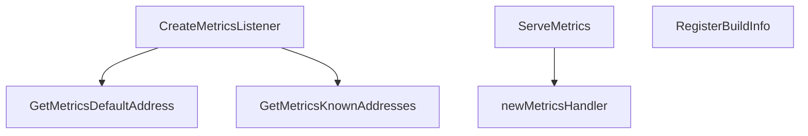

# Behavior Atom: metrics/metrics.go

## Source Anchor

- Go source: [cloudflare/cloudflared@2026.3.0/metrics/metrics.go](https://github.com/cloudflare/cloudflared/blob/2026.3.0/metrics/metrics.go)
- Package: metrics
- Module group: metrics

## Behavioral Responsibility

Management, diagnostics, and observability behavior.

## Entry Points

- GetMetricsDefaultAddress(runtimeType string) string (line 30)
- GetMetricsKnownAddresses(runtimeType string) []string (line 46)
- CreateMetricsListener(listeners *gracenet.Net, laddr string) (net.Listener, error) (line 108)
- ServeMetrics(l net.Listener, ctx context.Context, config Config, log *zerolog.Logger) err error (line 138)
- RegisterBuildInfo(buildType string, buildTime string, version string) (line 185)

## Internal Function Surface

- newMetricsHandler(config Config, log *zerolog.Logger)*http.ServeMux (line 68)

## Input Contract

- HTTP requests
- func-param:buildTime string
- func-param:buildType string
- func-param:config Config
- func-param:ctx context.Context
- func-param:l net.Listener
- func-param:laddr string
- func-param:listeners *gracenet.Net
- func-param:log *zerolog.Logger
- func-param:runtimeType string
- func-param:version string

## Output Contract

- HTTP response writes
- metrics emission
- return:*http.ServeMux
- return:[]string
- return:err error
- return:error
- return:net.Listener
- return:string
- stdout/stderr or structured logs

## Side Effects and State Transitions

- network I/O
- concurrency primitives
- timers and scheduling

## Branching and Failure Semantics

- Branch density: if=9, switch=2, select=0
- error-return paths
- fallback/default branches

## Import and Dependency Surface

- context
- fmt
- github.com/cloudflare/cloudflared/diagnostic
- github.com/facebookgo/grace/gracenet
- github.com/prometheus/client_golang/prometheus
- github.com/prometheus/client_golang/prometheus/promhttp
- github.com/rs/zerolog
- golang.org/x/net/trace
- net
- net/http
- net/http/pprof
- runtime
- sync
- time

## Go-Impl Flow (Intra-file)

## Rust Porting Notes

- **Gracenet fd-passing**: `facebookarchive/grace/gracenet` for socket inheritance → `listenfd` crate or `systemfd` for fd passing.
- **pprof endpoints**: `net/http/pprof` → no direct equivalent; use `pprof-rs` crate or expose `/debug` via custom Prometheus endpoint.
- **Context-based shutdown**: `context.WithCancel` for metrics server lifecycle → `tokio::select!` with `CancellationToken`.
- **Quirk — 9 if + 2 switch**: Server setup + handler routing; decompose into builder.

## Accuracy Notes

- Generated from Go AST parsing and source text pattern extraction.
- Source link is authoritative for disputed semantics; keep this atom synchronized with the linked file.
