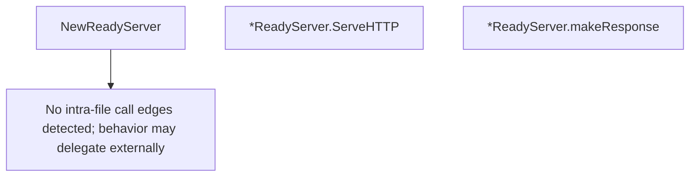

# Behavior Atom: metrics/readiness.go

## Source Anchor

- Go source: [cloudflare/cloudflared@2026.3.0/metrics/readiness.go](https://github.com/cloudflare/cloudflared/blob/2026.3.0/metrics/readiness.go)
- Package: metrics
- Module group: metrics

## Behavioral Responsibility

Management, diagnostics, and observability behavior.

## Entry Points

- NewReadyServer(clientID uuid.UUID, tracker *tunnelstate.ConnTracker)*ReadyServer (line 20)
- (*ReadyServer) ServeHTTP(w http.ResponseWriter, r*http.Request) (line 37)

## Internal Function Surface

- (*ReadyServer) makeResponse() (statusCode int, readyConnections uint) (line 54)

## Input Contract

- HTTP requests
- func-param:clientID uuid.UUID
- func-param:r *http.Request
- func-param:tracker *tunnelstate.ConnTracker
- func-param:w http.ResponseWriter

## Output Contract

- HTTP response writes
- return:*ReadyServer
- return:readyConnections uint
- return:statusCode int
- stdout/stderr or structured logs

## Side Effects and State Transitions

- network I/O

## Branching and Failure Semantics

- Branch density: if=2, switch=0, select=0
- error-return paths

## Import and Dependency Surface

- encoding/json
- fmt
- github.com/cloudflare/cloudflared/tunnelstate
- github.com/google/uuid
- net/http

## Go-Impl Flow (Intra-file)

## Rust Porting Notes

- **Readiness handler**: Checks `tunnelstate.ConnTracker` and returns JSON → `axum::Json` response from shared `Arc<ConnTracker>` state.
- **Quirk — 2 if-branches**: Minimal ready/not-ready check.

## Accuracy Notes

- Generated from Go AST parsing and source text pattern extraction.
- Source link is authoritative for disputed semantics; keep this atom synchronized with the linked file.
