# Behavior Atom: mocks/mock_limiter.go

## Source Anchor

- Go source: [cloudflare/cloudflared@2026.3.0/mocks/mock_limiter.go](https://github.com/cloudflare/cloudflared/blob/2026.3.0/mocks/mock_limiter.go)
- Package: mocks
- Module group: mocks

## Behavioral Responsibility

Core package behavior anchored to this source file.

## Entry Points

- NewMockLimiter(ctrl *gomock.Controller)*MockLimiter (line 31)
- (*MockLimiter) EXPECT()*MockLimiterMockRecorder (line 38)
- (*MockLimiter) Acquire(flowType string) error (line 43)
- (*MockLimiterMockRecorder) Acquire(flowType any)*MockLimiterAcquireCall (line 51)
- (*MockLimiterAcquireCall) Return(arg0 error)*MockLimiterAcquireCall (line 63)
- (*MockLimiterAcquireCall) Do(f func(string) error)*MockLimiterAcquireCall (line 69)
- (*MockLimiterAcquireCall) DoAndReturn(f func(string) error)*MockLimiterAcquireCall (line 75)
- (*MockLimiter) Release() (line 81)
- (*MockLimiterMockRecorder) Release()*MockLimiterReleaseCall (line 87)
- (*MockLimiterReleaseCall) Return()*MockLimiterReleaseCall (line 99)
- (*MockLimiterReleaseCall) Do(f func())*MockLimiterReleaseCall (line 105)
- (*MockLimiterReleaseCall) DoAndReturn(f func())*MockLimiterReleaseCall (line 111)
- (*MockLimiter) SetLimit(arg0 uint64) (line 117)
- (*MockLimiterMockRecorder) SetLimit(arg0 any)*MockLimiterSetLimitCall (line 123)
- (*MockLimiterSetLimitCall) Return()*MockLimiterSetLimitCall (line 135)
- (*MockLimiterSetLimitCall) Do(f func(uint64))*MockLimiterSetLimitCall (line 141)
- (*MockLimiterSetLimitCall) DoAndReturn(f func(uint64))*MockLimiterSetLimitCall (line 147)

## Internal Function Surface

- None detected.

## Input Contract

- func-param:arg0 any
- func-param:arg0 error
- func-param:arg0 uint64
- func-param:ctrl *gomock.Controller
- func-param:f func()
- func-param:f func(string) error
- func-param:f func(uint64)
- func-param:flowType any
- func-param:flowType string

## Output Contract

- return:*MockLimiter
- return:*MockLimiterAcquireCall
- return:*MockLimiterMockRecorder
- return:*MockLimiterReleaseCall
- return:*MockLimiterSetLimitCall
- return:error

## Side Effects and State Transitions

- No high-signal side effect pattern detected in static scan.

## Branching and Failure Semantics

- Branch density: if=0, switch=0, select=0
- No explicit failure pattern markers found in static scan.

## Import and Dependency Surface

- go.uber.org/mock/gomock
- reflect

## Go-Impl Flow (Intra-file)

```mermaid
flowchart TD
    F1["NewMockLimiter"]
    F2["*MockLimiter.EXPECT"]
    F3["*MockLimiter.Acquire"]
    F4["*MockLimiterMockRecorder.Acquire"]
    F5["*MockLimiterAcquireCall.Return"]
    F6["*MockLimiterAcquireCall.Do"]
    F7["*MockLimiterAcquireCall.DoAndReturn"]
    F8["*MockLimiter.Release"]
    F9["*MockLimiterMockRecorder.Release"]
    F10["*MockLimiterReleaseCall.Return"]
    F11["*MockLimiterReleaseCall.Do"]
    F12["*MockLimiterReleaseCall.DoAndReturn"]
    F13["*MockLimiter.SetLimit"]
    F14["*MockLimiterMockRecorder.SetLimit"]
    F15["*MockLimiterSetLimitCall.Return"]
    F16["*MockLimiterSetLimitCall.Do"]
    F17["*MockLimiterSetLimitCall.DoAndReturn"]
    NOTE["No intra-file call edges detected; behavior may delegate externally"]
    F1 --> NOTE
```

## Rust Porting Notes

- **Generated mock**: `gomock`-generated `MockLimiter` → drop; derive with `#[automock]` on `Limiter` trait or write manual mock struct.

## Accuracy Notes

- Generated from Go AST parsing and source text pattern extraction.
- Source link is authoritative for disputed semantics; keep this atom synchronized with the linked file.
