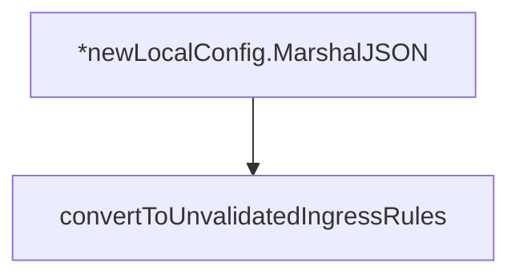

# Behavior Atom: orchestration/config.go

## Source Anchor

- Go source: [cloudflare/cloudflared@2026.3.0/orchestration/config.go](https://github.com/cloudflare/cloudflared/blob/2026.3.0/orchestration/config.go)
- Package: orchestration
- Module group: orchestration

## Behavioral Responsibility

Core package behavior anchored to this source file.

## Entry Points

- (*newLocalConfig) MarshalJSON() ([]byte, error) (line 31)

## Internal Function Surface

- convertToUnvalidatedIngressRules(i ingress.Ingress) []config.UnvalidatedIngressRule (line 48)

## Input Contract

- func-param:i ingress.Ingress

## Output Contract

- return:[]byte
- return:[]config.UnvalidatedIngressRule
- return:error

## Side Effects and State Transitions

- network I/O

## Branching and Failure Semantics

- Branch density: if=1, switch=0, select=0
- No explicit failure pattern markers found in static scan.

## Import and Dependency Surface

- encoding/json
- github.com/cloudflare/cloudflared/config
- github.com/cloudflare/cloudflared/ingress

## Go-Impl Flow (Intra-file)

## Rust Porting Notes

- **JSON marshaling**: Ingress rule conversion to/from JSON → `#[derive(Serialize, Deserialize)]` with `serde_json`.
- **Quirk — 1 if-branch**: Minimal; direct translation.

## Accuracy Notes

- Generated from Go AST parsing and source text pattern extraction.
- Source link is authoritative for disputed semantics; keep this atom synchronized with the linked file.
