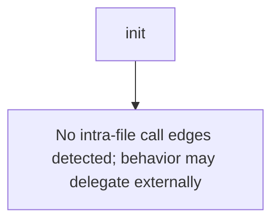

# Behavior Atom: orchestration/metrics.go

## Source Anchor

- Go source: [cloudflare/cloudflared@2026.3.0/orchestration/metrics.go](https://github.com/cloudflare/cloudflared/blob/2026.3.0/orchestration/metrics.go)
- Package: orchestration
- Module group: orchestration

## Behavioral Responsibility

Core package behavior anchored to this source file.

## Entry Points

- init() (line 23)

## Internal Function Surface

- None detected.

## Input Contract

- Inputs are indirect through callers; no direct input pattern detected statically.

## Output Contract

- metrics emission

## Side Effects and State Transitions

- No high-signal side effect pattern detected in static scan.

## Branching and Failure Semantics

- Branch density: if=0, switch=0, select=0
- No explicit failure pattern markers found in static scan.

## Import and Dependency Surface

- github.com/prometheus/client_golang/prometheus

## Go-Impl Flow (Intra-file)

## Rust Porting Notes

- **init() metric registration**: `init()` auto-registering Prometheus counters → `once_cell::sync::Lazy<prometheus::IntCounter>` or `LazyLock`.
- **Quirk — zero branching**: Pure declarations; direct translation.

## Accuracy Notes

- Generated from Go AST parsing and source text pattern extraction.
- Source link is authoritative for disputed semantics; keep this atom synchronized with the linked file.
