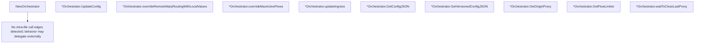

# Behavior Atom: orchestration/orchestrator.go

## Source Anchor

- Go source: [cloudflare/cloudflared@2026.3.0/orchestration/orchestrator.go](https://github.com/cloudflare/cloudflared/blob/2026.3.0/orchestration/orchestrator.go)
- Package: orchestration
- Module group: orchestration

## Behavioral Responsibility

Core package behavior anchored to this source file.

## Entry Points

- NewOrchestrator(ctx context.Context, config *Config, tags []pogs.Tag, internalRules []ingress.Rule, log*zerolog.Logger) (*Orchestrator, error) (line 51)
- (*Orchestrator) UpdateConfig(version int32, config []byte)*pogs.UpdateConfigurationResponse (line 78)
- (*Orchestrator) GetConfigJSON() ([]byte, error) (line 204)
- (*Orchestrator) GetVersionedConfigJSON() ([]byte, error) (line 220)
- (*Orchestrator) GetOriginProxy() (connection.OriginProxy, error) (line 246)
- (*Orchestrator) GetFlowLimiter() cfdflow.Limiter (line 264)

## Internal Function Surface

- (*Orchestrator) overrideRemoteWarpRoutingWithLocalValues(remoteWarpRouting*ingress.WarpRoutingConfig) error (line 127)
- (*Orchestrator) overrideMaxActiveFlows(maxActiveFlowsLocalConfig string, remoteWarpRouting*ingress.WarpRoutingConfig) error (line 133)
- (*Orchestrator) updateIngress(ingressRules ingress.Ingress, warpRouting ingress.WarpRoutingConfig) error (line 150)
- (*Orchestrator) waitToCloseLastProxy() (line 268)

## Input Contract

- func-param:config *Config
- func-param:config []byte
- func-param:ctx context.Context
- func-param:ingressRules ingress.Ingress
- func-param:internalRules []ingress.Rule
- func-param:log *zerolog.Logger
- func-param:maxActiveFlowsLocalConfig string
- func-param:remoteWarpRouting *ingress.WarpRoutingConfig
- func-param:tags []pogs.Tag
- func-param:version int32
- func-param:warpRouting ingress.WarpRoutingConfig
- serialized configuration payloads

## Output Contract

- return:*Orchestrator
- return:*pogs.UpdateConfigurationResponse
- return:[]byte
- return:cfdflow.Limiter
- return:connection.OriginProxy
- return:error
- stdout/stderr or structured logs

## Side Effects and State Transitions

- network I/O
- concurrency primitives

## Branching and Failure Semantics

- Branch density: if=13, switch=0, select=1
- error-return paths
- fallback/default branches

## Import and Dependency Surface

- context
- encoding/json
- fmt
- github.com/cloudflare/cloudflared/cmd/cloudflared/flags
- github.com/cloudflare/cloudflared/config
- github.com/cloudflare/cloudflared/connection
- github.com/cloudflare/cloudflared/flow
- github.com/cloudflare/cloudflared/ingress
- github.com/cloudflare/cloudflared/proxy
- github.com/cloudflare/cloudflared/tunnelrpc/pogs
- github.com/pkg/errors
- github.com/rs/zerolog
- strconv
- sync
- sync/atomic

## Go-Impl Flow (Intra-file)

## Accuracy Notes

- Generated from Go AST parsing and source text pattern extraction.
- Source link is authoritative for disputed semantics; keep this atom synchronized with the linked file.

## Rust Porting Notes

- **Config hot-reload**: `sync.RWMutex`-guarded `currentConfig` → `arc_swap::ArcSwap<Config>` for lock-free reads with occasional writes, or `tokio::sync::RwLock` if write-side needs async.
- **Atomic version**: `sync/atomic` int32 version counter → `std::sync::atomic::AtomicI32` with `Ordering::SeqCst` for version monotonicity.
- **JSON config parsing**: `encoding/json.Unmarshal` for config updates → `serde_json::from_slice` with `#[derive(Deserialize)]` config structs.
- **Origin proxy swap**: `GetOriginProxy` returns current proxy behind read lock → `ArcSwap::load()` returns an `Arc<dyn OriginProxy>` clone without lock contention.
- **Flow limiter**: `GetFlowLimiter` exposes a rate limiter → `Arc<dyn FlowLimiter>` or `Arc<Semaphore>` shared across connections.
- **Ingress rules**: Internal rules merged with remote config → build a typed `IngressConfig` struct that combines both sources during `UpdateConfig`.
- **Quirk — select with 1 case**: Single-case select on context cancellation in `NewOrchestrator` — simplify to a direct `ctx.done().await` check.
