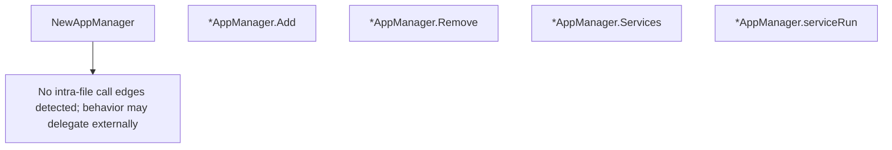

# Behavior Atom: overwatch/app_manager.go

## Source Anchor

- Go source: [cloudflare/cloudflared@2026.3.0/overwatch/app_manager.go](https://github.com/cloudflare/cloudflared/blob/2026.3.0/overwatch/app_manager.go)
- Package: overwatch
- Module group: overwatch

## Behavioral Responsibility

Runtime lifecycle and orchestration behavior.

## Entry Points

- NewAppManager(callback ServiceCallback) Manager (line 16)
- (*AppManager) Add(service Service) (line 23)
- (*AppManager) Remove(name string) (line 38)
- (*AppManager) Services() []Service (line 46)

## Internal Function Surface

- (*AppManager) serviceRun(service Service) (line 54)

## Input Contract

- func-param:callback ServiceCallback
- func-param:name string
- func-param:service Service

## Output Contract

- return:Manager
- return:[]Service

## Side Effects and State Transitions

- No high-signal side effect pattern detected in static scan.

## Branching and Failure Semantics

- Branch density: if=4, switch=0, select=0
- error-return paths

## Import and Dependency Surface

- No imports.

## Go-Impl Flow (Intra-file)

## Rust Porting Notes

- **Service lifecycle map**: Map-based service storage with `ServiceCallback` → `HashMap<ServiceId, Box<dyn ServiceCallback>>` or generic service registry.
- **Quirk — 4 if-branches**: Service existence checks; use `HashMap::entry()` API.

## Accuracy Notes

- Generated from Go AST parsing and source text pattern extraction.
- Source link is authoritative for disputed semantics; keep this atom synchronized with the linked file.
