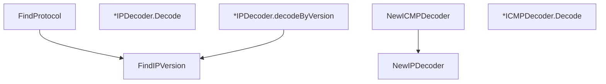

# Behavior Atom: packet/decoder.go

## Source Anchor

- Go source: [cloudflare/cloudflared@2026.3.0/packet/decoder.go](https://github.com/cloudflare/cloudflared/blob/2026.3.0/packet/decoder.go)
- Package: packet
- Module group: packet

## Behavioral Responsibility

Core package behavior anchored to this source file.

## Entry Points

- FindProtocol(p []byte) (layers.IPProtocol, error) (line 12)
- FindIPVersion(p []byte) (uint8, error) (line 35)
- NewIPDecoder() *IPDecoder (line 53)
- (*IPDecoder) Decode(packet RawPacket) (*IP, error) (line 78)
- NewICMPDecoder() *ICMPDecoder (line 124)
- (*ICMPDecoder) Decode(packet RawPacket) (*ICMP, error) (line 142)

## Internal Function Surface

- (*IPDecoder) decodeByVersion(packet []byte) ([]gopacket.LayerType, error) (line 96)

## Input Contract

- func-param:p []byte
- func-param:packet RawPacket
- func-param:packet []byte

## Output Contract

- return:*ICMP
- return:*ICMPDecoder
- return:*IP
- return:*IPDecoder
- return:[]gopacket.LayerType
- return:error
- return:layers.IPProtocol
- return:uint8

## Side Effects and State Transitions

- No high-signal side effect pattern detected in static scan.

## Branching and Failure Semantics

- Branch density: if=12, switch=4, select=0
- error-return paths
- fallback/default branches

## Import and Dependency Surface

- fmt
- github.com/google/gopacket
- github.com/google/gopacket/layers
- github.com/pkg/errors
- golang.org/x/net/icmp

## Go-Impl Flow (Intra-file)

## Rust Porting Notes

- **gopacket decoding**: `gopacket.NewPacket` + `layers.IPv4/IPv6/ICMPv4` → `etherparse::SlicedPacket::from_ip()` or `pnet_packet` crate for IP/ICMP dissection.
- **Layer extraction**: `packet.Layer(layers.LayerTypeICMPv4)` → pattern match on parsed packet enum variant.
- **Quirk — 12 if + 4 switch**: Heavy layer-type dispatch; use nested `match` on protocol layers.

## Accuracy Notes

- Generated from Go AST parsing and source text pattern extraction.
- Source link is authoritative for disputed semantics; keep this atom synchronized with the linked file.
