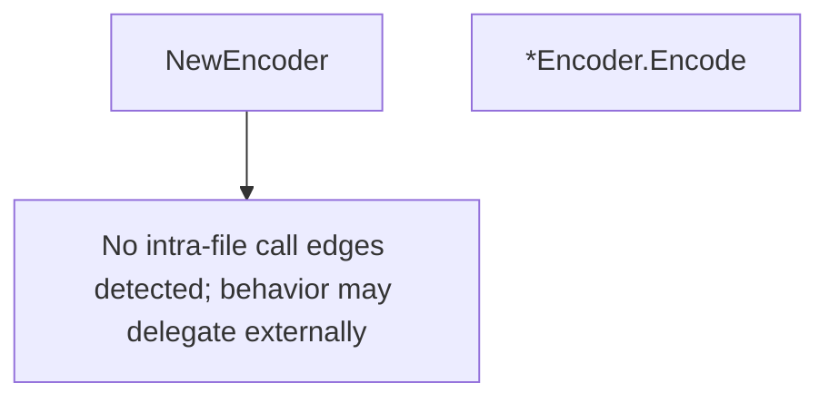

# Behavior Atom: packet/encoder.go

## Source Anchor

- Go source: [cloudflare/cloudflared@2026.3.0/packet/encoder.go](https://github.com/cloudflare/cloudflared/blob/2026.3.0/packet/encoder.go)
- Package: packet
- Module group: packet

## Behavioral Responsibility

Core package behavior anchored to this source file.

## Entry Points

- NewEncoder() *Encoder (line 24)
- (*Encoder) Encode(packet Packet) (RawPacket, error) (line 30)

## Internal Function Surface

- None detected.

## Input Contract

- func-param:packet Packet

## Output Contract

- return:*Encoder
- return:RawPacket
- return:error

## Side Effects and State Transitions

- No high-signal side effect pattern detected in static scan.

## Branching and Failure Semantics

- Branch density: if=2, switch=0, select=0
- error-return paths

## Import and Dependency Surface

- github.com/google/gopacket

## Go-Impl Flow (Intra-file)

## Rust Porting Notes

- **gopacket serialization**: `gopacket.SerializeLayers` → `etherparse::PacketBuilder` or manual byte serialization with `bytes::BufMut`.
- **Quirk — 2 if-branches**: Minimal; direct translation.

## Accuracy Notes

- Generated from Go AST parsing and source text pattern extraction.
- Source link is authoritative for disputed semantics; keep this atom synchronized with the linked file.
