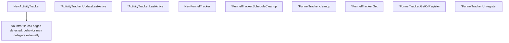

# Behavior Atom: packet/funnel.go

## Source Anchor

- Go source: [cloudflare/cloudflared@2026.3.0/packet/funnel.go](https://github.com/cloudflare/cloudflared/blob/2026.3.0/packet/funnel.go)
- Package: packet
- Module group: packet

## Behavioral Responsibility

Core package behavior anchored to this source file.

## Entry Points

- NewActivityTracker() *ActivityTracker (line 42)
- (*ActivityTracker) UpdateLastActive() (line 48)
- (*ActivityTracker) LastActive() time.Time (line 52)
- NewFunnelTracker() *FunnelTracker (line 70)
- (*FunnelTracker) ScheduleCleanup(ctx context.Context, idleTimeout time.Duration) (line 76)
- (*FunnelTracker) Get(id FunnelID) (Funnel, bool) (line 104)
- (*FunnelTracker) GetOrRegister(id FunnelID, shouldReplaceFunc func(Funnel) bool, newFunnelFunc func() (Funnel, error)) (funnel Funnel, new bool, err error) (line 114)
- (*FunnelTracker) Unregister(id FunnelID, funnel Funnel) deleted bool (line 138)

## Internal Function Surface

- (*FunnelTracker) cleanup(idleTimeout time.Duration) (line 90)

## Input Contract

- func-param:ctx context.Context
- func-param:funnel Funnel
- func-param:id FunnelID
- func-param:idleTimeout time.Duration
- func-param:newFunnelFunc func() (Funnel, error)
- func-param:shouldReplaceFunc func(Funnel) bool

## Output Contract

- return:*ActivityTracker
- return:*FunnelTracker
- return:Funnel
- return:bool
- return:deleted bool
- return:err error
- return:funnel Funnel
- return:new bool
- return:time.Time

## Side Effects and State Transitions

- concurrency primitives
- timers and scheduling

## Branching and Failure Semantics

- Branch density: if=6, switch=0, select=1
- error-return paths

## Import and Dependency Surface

- context
- errors
- fmt
- net/netip
- sync
- sync/atomic
- time

## Go-Impl Flow (Intra-file)

## Rust Porting Notes

- **Concurrent map with TTL**: `sync.Map` + `sync/atomic` counters + goroutine cleanup via `select` → `DashMap<FunnelId, FunnelEntry>` with `tokio::spawn` idle-timeout eviction task.
- **Context-driven cleanup**: `context.WithCancel` for funnel lifecycle → per-funnel `CancellationToken`.
- **Quirk — 6 if-branches**: Idle-check + existence validation.

## Accuracy Notes

- Generated from Go AST parsing and source text pattern extraction.
- Source link is authoritative for disputed semantics; keep this atom synchronized with the linked file.
