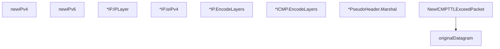

# Behavior Atom: packet/packet.go

## Source Anchor

- Go source: [cloudflare/cloudflared@2026.3.0/packet/packet.go](https://github.com/cloudflare/cloudflared/blob/2026.3.0/packet/packet.go)
- Package: packet
- Module group: packet

## Behavioral Responsibility

Core package behavior anchored to this source file.

## Entry Points

- (*IP) IPLayer()*IP (line 78)
- (*IP) EncodeLayers() ([]gopacket.SerializableLayer, error) (line 86)
- (*ICMP) EncodeLayers() ([]gopacket.SerializableLayer, error) (line 116)
- (*PseudoHeader) Marshal() []byte (line 150)
- NewICMPTTLExceedPacket(originalIP *IP, originalPacket RawPacket, routerIP netip.Addr)*ICMP (line 164)

## Internal Function Surface

- newIPv4(ipLayer *layers.IPv4) (*IP, error) (line 44)
- newIPv6(ipLayer *layers.IPv6) (*IP, error) (line 61)
- (*IP) isIPv4() bool (line 82)
- originalDatagram(originalPacket RawPacket, isIPv4 bool) []byte (line 197)

## Input Contract

- func-param:ipLayer *layers.IPv4
- func-param:ipLayer *layers.IPv6
- func-param:isIPv4 bool
- func-param:originalIP *IP
- func-param:originalPacket RawPacket
- func-param:routerIP netip.Addr

## Output Contract

- return:*ICMP
- return:*IP
- return:[]byte
- return:[]gopacket.SerializableLayer
- return:bool
- return:error

## Side Effects and State Transitions

- No high-signal side effect pattern detected in static scan.

## Branching and Failure Semantics

- Branch density: if=12, switch=0, select=0
- error-return paths

## Import and Dependency Surface

- encoding/binary
- fmt
- github.com/google/gopacket
- github.com/google/gopacket/layers
- golang.org/x/net/icmp
- golang.org/x/net/ipv4
- golang.org/x/net/ipv6
- net/netip

## Go-Impl Flow (Intra-file)

## Rust Porting Notes

- **IP/ICMP construction**: `gopacket/layers` for packet building + `encoding/binary` → `etherparse::PacketBuilder` or `pnet_packet::icmp::MutableIcmpPacket`.
- **x/net/icmp**: `icmp.Message.Marshal()` → manual ICMP checksum + serialization or `pnet` crate.
- **Quirk — 12 if-branches**: Protocol-specific construction paths; use `match` on IP version + ICMP type.

## Accuracy Notes

- Generated from Go AST parsing and source text pattern extraction.
- Source link is authoritative for disputed semantics; keep this atom synchronized with the linked file.
